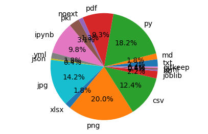
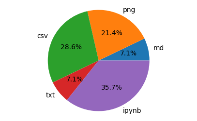
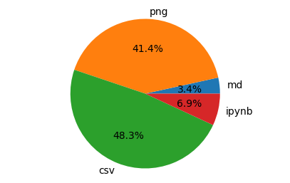
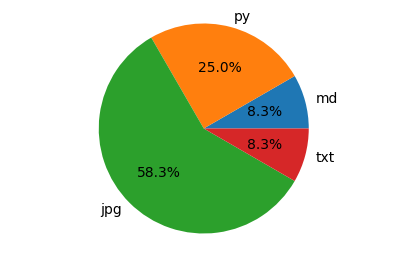

# 🌌 HR-Tech Universe Documentation
_Generated 2025-10-29 05:46_

---

## 🌐 Repository: `hr-tech-portfolio`
**Files:** 225 **Size:** 43.3 MB

### File Type Distribution
{'txt': 5, 'md': 4, 'py': 41, 'pdf': 21, 'noext': 3, 'pkl': 7, 'ipynb': 22, 'yml': 4, 'json': 1, 'jpg': 32, 'xlsx': 4, 'png': 45, 'csv': 28, 'joblib': 5, 'db': 1, 'toml': 1, 'gitkeep': 1}

### Top-Level Structure
- 📂 .devcontainer/
- 📂 .git/
- 📂 .github/
- 📄 MASTER_DOCUMENTATION.md
- 📄 MASTER_DOCUMENTATION.pdf
- 📄 README.md
- 📄 app.py
- 📂 backups/
- 📄 cb_dashboard.py
- 📂 cb_dashboard_artifacts/
- 📂 charts/
- 📂 data/
- 📂 faker_data/
- 📂 helper_scripts/
- 📂 images/
- 📂 models/
- 📂 models_joblib/
- 📂 notebooks/
- 📂 people_analytics/
- 📂 reports/
- 📄 requirements.txt
- 📄 runtime.txt
- 📂 scripts/
- 📂 sidequests/

---

## 🌐 Repository: `python-fundamentals-lab`
**Files:** 14 **Size:** 8.7 MB

### File Type Distribution
{'md': 1, 'png': 3, 'csv': 4, 'txt': 1, 'ipynb': 5}

### Top-Level Structure
- 📂 .git/
- 📄 README.md
- 📂 data/
- 📂 images/
- 📂 notebooks/

---

## 🌐 Repository: `SQL-Fundamentals-Lab`
**Files:** 29 **Size:** 9.8 MB

### File Type Distribution
{'md': 1, 'png': 12, 'csv': 14, 'ipynb': 2}

### Top-Level Structure
- 📂 .git/
- 📄 README.md
- 📂 data/
- 📂 faker_data/
- 📂 images/
- 📂 notebooks/

---

## 🌐 Repository: `Personal_Apps`
**Files:** 12 **Size:** 1.4 MB

### File Type Distribution
{'md': 1, 'py': 3, 'jpg': 7, 'txt': 1}

### Top-Level Structure
- 📂 .git/
- 📂 Kaalachakra/
- 📄 README.md
- 📄 app.py
- 📂 images/