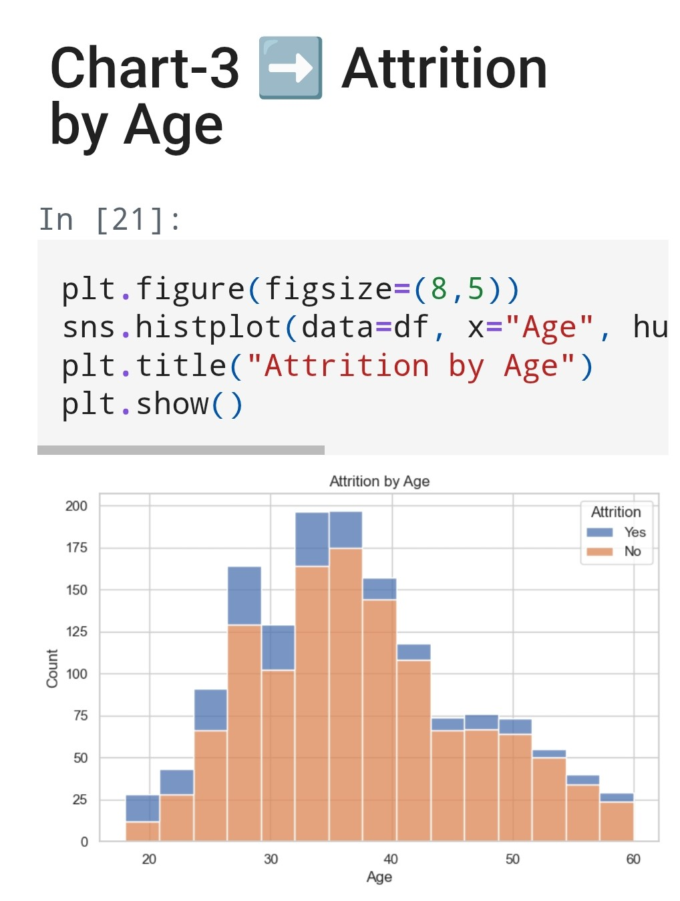
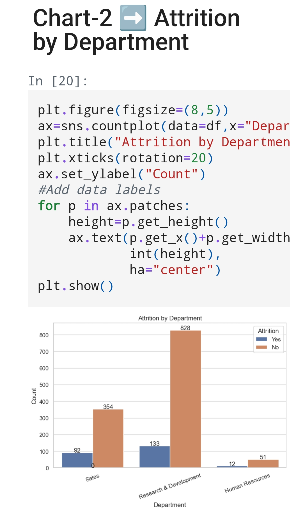
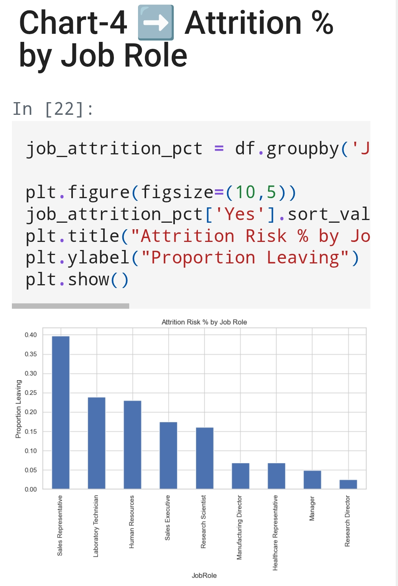
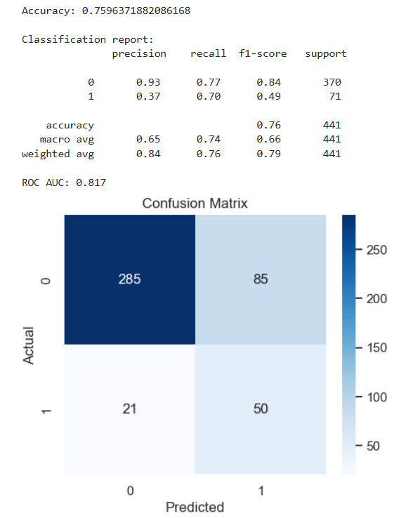
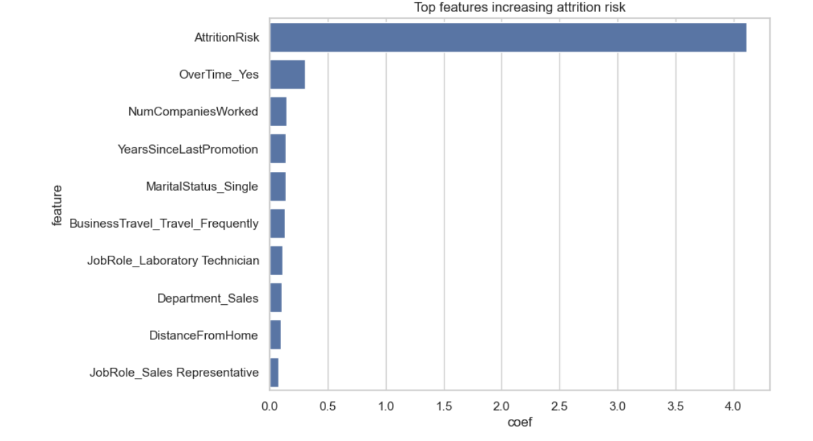
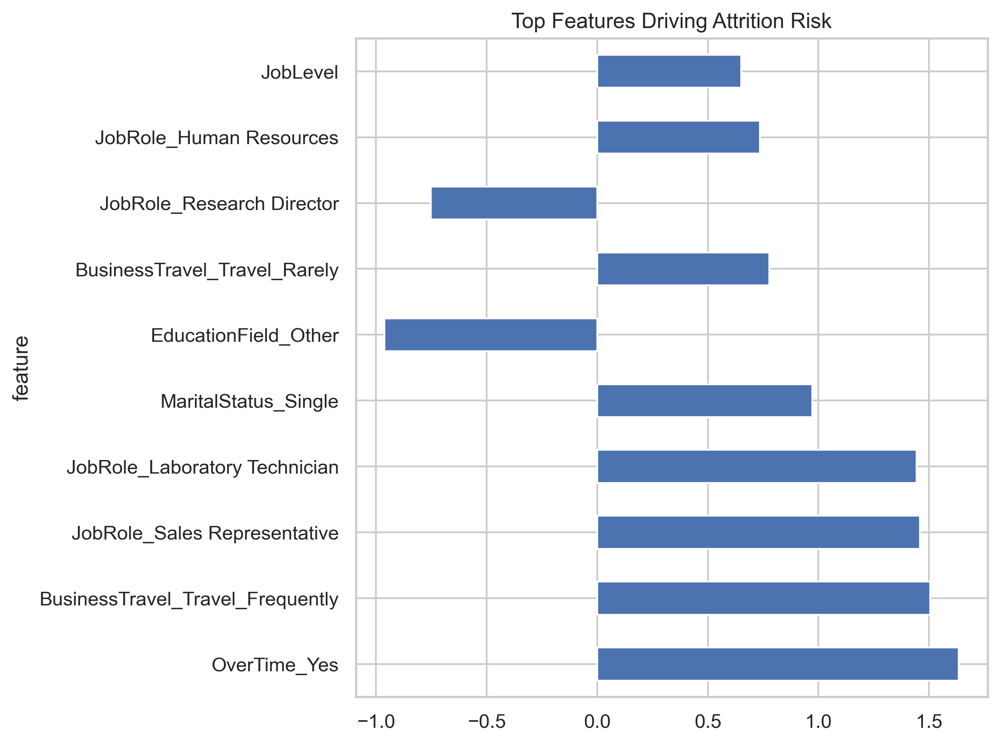
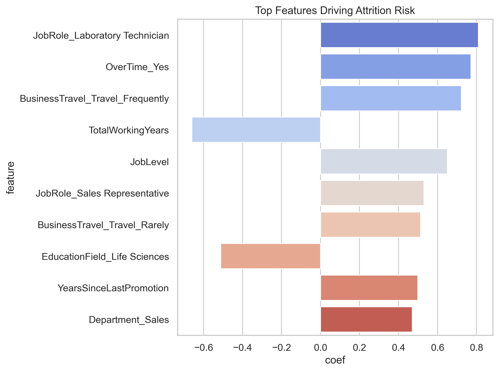
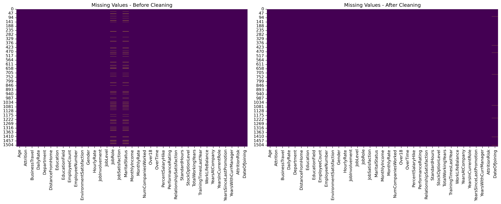
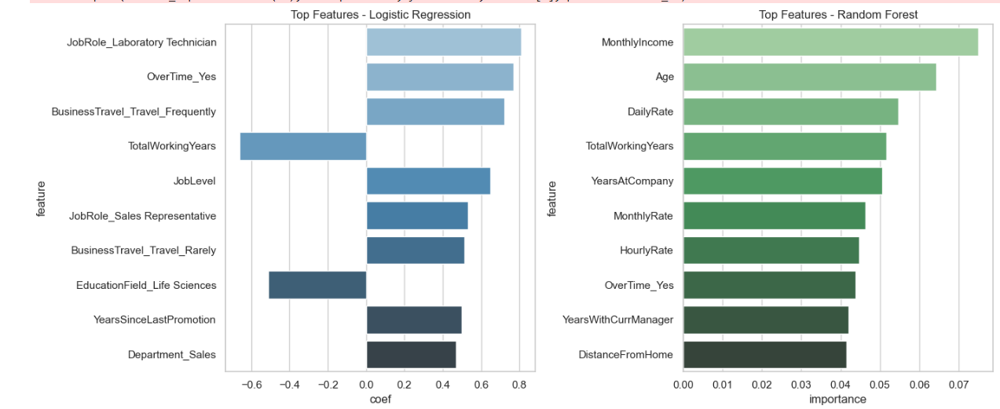

# HR Tech Portfolio  


  
  
  
  
  
  

This repository showcases my journey into **HR Tech & People Analytics**.

This repository showcases my journey into **HR Tech & People Analytics**.  
It contains hands-on projects where I apply **Python, Pandas, Seaborn, and People Analytics concepts** to real-world HR data.  

---

## 📊 Project 1: Attrition Risk Analyzer (v1.0)

### v1.0 — Descriptive Insights
**Objective:**  
Analyze IBM’s HR Attrition dataset to identify patterns of employee attrition, create a risk flag, and visualize insights.

---

**Why This Matters (Business Context):**  
Employee attrition directly impacts business costs through lost productivity, rehiring, and retraining.  
By identifying high-risk roles and departments, organizations can proactively design retention strategies,  
reduce turnover costs, and improve workforce stability.

---

**Key Steps:**  
1. Load and explore the dataset (1470 employees, 35 features).  
2. Analyze attrition distribution overall and by job role.  
3. Create a binary attrition risk flag (Yes = 1, No = 0).  
4. Build visualizations:
   - Overall attrition counts  
   - Attrition by department  
   - Attrition by age distribution  
   - Attrition % by job role  

📓 [View the Jupyter Notebook](Day4-AttritionRiskAnalyzer.ipynb)  

---

### v2.0 — Predictive Modeling (Logistic Regression)  

**Objective:**  
Move from descriptive analytics → predictive insights by using **Logistic Regression** to forecast employee attrition risk. 

**Key Steps:**  
1. Data preprocessing  
   - Dropped irrelevant features (EmployeeNumber, Over18, etc.)  
   - Encoded categorical variables via one-hot encoding  
   - Scaled numeric features  
   - Train-test split (70/30)  
2. Model training with Logistic Regression (`scikit-learn`)  
3. Model evaluation  
   - Accuracy score  
   - Confusion matrix  
   - Classification report (precision, recall, F1)  
   - ROC-AUC score  
4. Feature importance analysis → which factors most influence attrition risk  
5. Saved trained model + scaler into `/models/`  
6. Fixed Data Leakage issue and added enhancements
   
📓 [View the Predictive Notebook](Attrition_PredictiveModel_V2.ipynb)  

---


## 🖼️ Visuals & Outputs  

### Descriptive Analytics (v1.0)
# Attrition by Age:

  

*Attrition counts (Yes/No) by Age*  

# Attrition by Department:  

  

*Attrition counts (Yes/No) per Department*  

# Attrition % by Job Role:  

  

*Percentage of employees leaving by Job Role*  

### Predictive Analytics (v2.0)  
  
*Confusion Matrix — Logistic Regression performance*  

  
*Top 10 features influencing attrition risk* 

  
*Top 10 features influencing attrition risk - Enhanced Model*

---

## 🔍 Key Insights  

- Overall attrition rate: **16.1%**  
- Job roles with highest attrition:  
  - Sales Representatives → 39% attrition (83 out of 220 left)  
  - Laboratory Technicians → 23% attrition (62 out of 259 left)  
- Lowest attrition: **R&D (13.8%)** → strongest retention  
- Highest attrition: **Sales (20.6%)** → weakest retention  
- HR is small (63 employees), but attrition rate is relatively high (19%)  
- Age groups younger than ~30 show elevated risk compared to older cohorts  

**From Predictive Model:**  
- Logistic Regression achieved ~`75.9%` accuracy, ROC-AUC = `0.817`.  
- Key positive attrition drivers: *Overtime, JobRole_SalesRep, MaritalStatus_Single, etc.*  
- Key retention drivers: *JobLevel, YearsAtCompany, MonthlyIncome*. 

---
## Project 2- Predictive Attrition Model (v3.0) - Tuned Models

**Objective:**  
Enhance the baseline Logistic Regression model by applying **cross-validation** and **hyperparameter tuning** to improve stability and interpretability.  

**Key Steps:**  
1. Split dataset into training & test sets (80/20)  
2. Standardized numeric features with `StandardScaler`  
3. Trained baseline Logistic Regression (Day-5)  
4. Applied **5-fold cross-validation** to validate performance consistency  
5. Used **GridSearchCV** to tune hyperparameters (`C`, `penalty`, `solver`)  
6. Compared tuned vs baseline performance  

**Results:**  
- Baseline Accuracy: **XX%**  
- Tuned CV Accuracy: **XX%**  
- ROC AUC: **XX**  
- Best Parameters: `{ 'C': X, 'penalty': 'l1', 'solver': 'liblinear' }`  

**Sample Visuals:**  

Top Features Driving Attrition:  
  

**Insights:**  
- OverTime, Laboratory Technician roles, and Frequent Travel rank as top predictors.  
- Hyperparameter tuning improved model generalization, reducing overfitting risk.  
- Cross-validation confirmed stability of results across folds.
**Model Artifacts:**  
[logistic_top_features.csv](data/logistic_top_features.csv)
  
📓 [View the Predictive Notebook](Attrition_PredictiveModel_V3.ipynb)

---

## 📊 Project 3: HR Data Cleaning Utility (v1.0) (Side Quest-1)

This notebook demonstrates how to **simulate messy HR data** and then build a cleaning pipeline to make it analysis-ready.  
Data cleaning is a critical step in People Analytics — poor quality data = misleading insights.
# ✅ Conclusions

- Automated pipeline successfully cleaned the dataset.  
- Issues fixed: duplicates, missing values, inconsistent casing, invalid dates.  
- Outputs saved in:
  - [messy_hr_data.csv](data/messy_hr_data.csv)  
  - [cleaned_hr_data.csv](data/cleaned_hr_data.csv)  

**Hero Visual: Data Cleaning Impact**  



📓 [View the Utility Notebook](HR_Data_Cleaning_Utility_V1.ipynb)  


## 📊 Project 4: Attrition Model Comparison (v3.0)

**Objective:**  
Benchmark **Logistic Regression** against a **Random Forest classifier** to see if tree-based models improve prediction of employee attrition.

**Key Steps:**  
1. Prepared dataset with clean features (no leakage)  
2. Trained baseline Logistic Regression (linear, interpretable)  
3. Trained Random Forest (non-linear, ensemble)  
4. Compared performance using Accuracy & ROC AUC  
5. Visualized confusion matrices and feature importance  

**Results:**  
- Logistic Regression → Accuracy: **75%**, ROC AUC: **79%**  
- Random Forest → Accuracy: **83%**, ROC AUC: **77%**  
- Random Forest showed stronger performance on non-linear features, while Logistic remains more interpretable.  

**Sample Visuals:**  
Confusion Matrix Comparison:  
  

Top Features (Logistic vs Random Forest):  
- Logistic: OverTime, SalesRep role, MaritalStatus=Single  
- Random Forest: OverTime, MonthlyIncome, Age buckets  
📓 [View the Model Comparison Notebook](Attrition_ModelComparision.ipynb)

---

**Model Artifacts:**  
***Check Below for all Artifacts*** 
---

**Insights:**  
- Logistic = simple, transparent model (good for executive storytelling)  
- Random Forest = higher accuracy, captures complex patterns (good for prediction)  
- Next: try **XGBoost** and add **SHAP interpretability** for business-ready insights.


## ⚒️ Tech Stack  

- Python (Pandas, Matplotlib, Seaborn, scikit-learn, Jupyter Notebook)  
- SQL (SQLite for queries on HR dataset)
- Dataset: [IBM HR Analytics Attrition Dataset (Kaggle)](https://www.kaggle.com/datasets/pavansubhasht/ibm-hr-analytics-attrition-dataset)

---

## Model artifacts:(Updated & Tuned)
- [logistic_attrition_model.pkl](models/logistic_attrition_model.pkl)
- [scaler.pkl](models/scaler.pkl)
- [logistic_attrition_model_tuned.pkl](models/logistic_attrition_model_tuned.pkl)
- [random_forest_attrition_model.pkl](models/random_forest_attrition_model.pkl)
---

## 🛠️ How to Run This Project

Follow these steps to reproduce the analysis on your own system:

1. **Clone the repository**
   ```bash
   git clone https://github.com/AMBOT-pixel96/hr-tech-portfolio.git
   cd hr-tech-portfolio
2. **Create a virtual environment Using Conda:**
```bash
conda create -n hrtech python=3.10 -y
conda activate hrtech
```
3. **Install required packages**
```
pip install -r requirements.txt
```
4. Launch Jupyter Notebook

jupyter notebook


5. Open and run the notebooks

- [AttritionRiskAnalyzer_v2.0.ipynb → Descriptive Analytics](https://github.com/AMBOT-pixel96/hr-tech-portfolio/blob/main/Day4-AttritionRiskAnalyzer_v2.0.ipynb)
- [Attrition_PredictiveModel_V2.ipynb → Predictive Modeling](https://github.com/AMBOT-pixel96/hr-tech-portfolio/blob/main/Attrition_PredictiveModel_V2.ipynb)

[HR_Data_Cleaning_Utility_V1.ipynb → HR Data Cleanup Utility](https://github.com/AMBOT-pixel96/hr-tech-portfolio/blob/main/HR_Data_Cleaning_Utility_V1.ipynb)

---
## 🚀 Upcoming Projects  

- Compensation Analytics Dashboard
- SQL query library for HR datasets (attrition by job role, tenure, etc.)  
- Feature engineering + cross-validation for predictive modeling  
- Streamlit dashboard for interactive attrition prediction  

---

## 🧑‍💻 About Me  

I’m exploring the intersection of **Compensation & Benefits, HR Tech, and People Analytics**.  
This repo is my hands-on portfolio — tracking progress as I move from HR practitioner → HR Tech consultant.  

---

⭐️ If you find this interesting, follow my journey here or connect with me on LinkedIn.
