# HR Tech Portfolio
🧑‍💻 HR Tech & People Analytics Portfolio — from descriptive insights → predictive models → explainable AI.  

🌍 Live Demo - Attrition Prediction Dashboard [AttritionDashboard](https://hr-tech-portfolio.streamlit.app/)  
🌍 Live Demo - Compensation Dashboard [CompensationDashboard](https://cb-dashboard.streamlit.app/)

## [](https://github.com/AMBOT-pixel96/hr-tech-portfolio/raw/main/reports/Attrition_Project_Summary.pdf?download=1)

## 📑 Reports Panel

[](https://github.com/AMBOT-pixel96/hr-tech-portfolio/raw/main/reports/Attrition_Project_Summary.pdf?download=1)
[](reports/)
[](https://github.com/AMBOT-pixel96/hr-tech-portfolio/archive/refs/heads/main.zip)

---

  
  
  
  
  
  

This repository showcases my journey into **HR Tech & People Analytics**.

This repository showcases my journey into **HR Tech & People Analytics**.  
It contains hands-on projects where I apply **Python, Pandas, Seaborn, and People Analytics concepts** to real-world HR data.

---
## 📋 Project Overview

| #  | Project | Notebook / App | Highlight Results |
|----|---------|----------------|------------------|
| 1  | Attrition Risk Analyzer (v1.0) | [Day4-AttritionRiskAnalyzer.ipynb](notebooks/Day4-AttritionRiskAnalyzer.ipynb) | Attrition rate **16.1%**, highest in Sales Reps (**39%**) |
| 2  | Predictive Attrition Model (Logistic v2.0 / v3.0) | [Attrition_PredictiveModel_V2.ipynb](notebooks/Attrition_PredictiveModel_V2.ipynb), [V3](notebooks/Attrition_PredictiveModel_V3.ipynb) | Logistic ~**75% acc**, ROC AUC ~**0.80** |
| 3  | HR Data Cleaning Utility (Sidequest 1) | [HR_Data_Cleaning_Utility_V1.ipynb](sidequests/HR_Data_Cleaning_Utility_V1.ipynb) | Automated pipeline → `cleaned_hr_data.csv` |
| 4  | Model Comparison (Logistic vs RF) | [Attrition_ModelComparision.ipynb](notebooks/Attrition_ModelComparision.ipynb) | Logistic **75%**, RF **83%** |
| 5  | Advanced Models (RF + XGBoost) | [Attrition_AdvancedModels.ipynb](notebooks/Attrition_AdvancedModels.ipynb) | XGBoost best: **86.4% acc**, ROC AUC **0.774** |
| 6  | Explainability with SHAP | [Attrition_ModelExplainability.ipynb](notebooks/Attrition_ModelExplainability.ipynb) | Global drivers: Overtime, JobRole, Income |
| 7  | Interactive Attrition Dashboard | [app.py](app.py) | Streamlit app → Upload CSV, run predictions & SHAP |
| 8  | SQL + ML Integration | [Attrition_SQL_Integration-Git.ipynb](notebooks/Attrition_SQL_Integration-Git.ipynb) | Query DB → Predict attrition + donut, dept. breakdown |
| 9  | C&B Dashboard (Sidequest 2, v4.3) | [cb_dashboard.py](cb_dashboard.py), [requirements.txt](requirements.txt) <br> 🌍 [Live App](https://cb-dashboard.streamlit.app/) | Streamlit C&B tool → Avg/Median pay, bonus %, gender gap %, market benchmarking, board-ready PDF |
| 10 | Attrition Explainability with SHAP (Advanced) | [Attrition_SHAP_Explainability_V1.ipynb](notebooks/Attrition_SHAP_Explainability_V1.ipynb) | Top 15 drivers (bar chart), 44-driver CSV export, dependence & local explanations |
| 11 | Compensation Analytics (Day 2 – Seed) | [Compensation_Analytics_V1.ipynb](notebooks/Compensation_Analytics_V1.ipynb) | Avg CTC, Bonus %, Gender Pay Gap with CSV + visuals |
| 12 | Compensation Analytics (Day 3 – Extension V2) | [Compensation_Analytics_V2.ipynb](notebooks/Compensation_Analytics_V2.ipynb) | Median CTC, Dept-wise pay, Bonus % by Dept, polished exports |
| 13 | Compensation Analytics (Day 4 – V3) | [Compensation_Analytics_V3.ipynb](notebooks/Compensation_Analytics_V3.ipynb) | Bonus% vs CTC, JobLevel headcounts, Dept-wise averages |
| 14 | Compensation Analytics (Day 5 – V4 Exec Insights) | [Compensation_Analytics_V4.ipynb](notebooks/Compensation_Analytics_V4.ipynb) | Gender gap by level, Bonus % KDE, Quartile pay bands |
---

## 📂 Repository Structure  

<!-- REPO_TREE_START -->
```text
├── .devcontainer
│   └── devcontainer.json
├── README.md
├── app.py
├── backups
│   └── sample.txt
├── cb_dashboard.py
├── cb_dashboard_artifacts
│   ├── README.md
│   ├── data
│   │   ├── benchmarking_data_fakergen.xlsx
│   │   └── employee_compensation_fakergen.xlsx
│   ├── exports
│   │   ├── CB_User_Guide.pdf
│   │   └── Cb_Report_consolidated.pdf
│   └── ... (1 more)
├── data
│   ├── Attrition_SQL_Predictions.csv
│   ├── Comp_Analytics_Processed.csv
│   ├── bonus_by_department.csv
│   └── ... (19 more)
├── faker_data
│   ├── FakerGen_CB.ipynb
│   ├── benchmarking_data_fakergen.xlsx
│   ├── employee_compensation_fakergen.xlsx
│   └── ... (1 more)
├── helper_scripts
│   ├── hr_db.py
│   └── sql_utils.py
├── images
│   ├── Attrition_by_dept.jpg
│   ├── attrition_by_age.jpg
│   ├── attrition_by_jobrole.png
│   └── ... (43 more)
├── models
│   ├── Attrition_AdvancedModels.ipynb
│   ├── logistic_attrition_model.pkl
│   ├── logistic_attrition_model_tuned.pkl
│   └── ... (6 more)
├── models_joblib
│   ├── logistic_attrition_model.joblib
│   ├── random_forest_attrition_model.joblib
│   ├── scaler.joblib
│   └── ... (2 more)
├── notebooks
│   ├──  Attrition_PredictiveModel.ipynb
│   ├── Attrition_AdvancedModels.ipynb
│   ├── Attrition_ModelComparision.ipynb
│   └── ... (14 more)
├── people_analytics
│   ├── .streamlit
│   │   └── config.toml
│   ├── HR_DataForge.ipynb
│   ├── README.md
│   └── ... (6 more)
├── reports
│   ├── Attrition_AdvancedModels_aa41c1310f907082a92a9e51b94010b5.pdf
│   ├── Attrition_ModelComparision_009086358233572ffb338cf8f4ee6ab7.pdf
│   ├── Attrition_ModelExplainability_52d61660976d1481ab051617939779a2.pdf
│   └── ... (15 more)
├── requirements.txt
├── runtime.txt
├── scripts
│   ├── export_pdf.py
│   └── gen_tree.py
└── sidequests
    └── HR_Data_Cleaning_Utility_V1.ipynb
```
<!-- REPO_TREE_END -->

---

## 📊 Project 1: Attrition Risk Analyzer (v1.0)

### v1.0 — Descriptive Insights
**Objective:**  
Analyze IBM’s HR Attrition dataset to identify patterns of employee attrition, create a risk flag, and visualize insights.

---

**Why This Matters (Business Context):**  
Employee attrition directly impacts business costs through lost productivity, rehiring, and retraining.  
By identifying high-risk roles and departments, organizations can proactively design retention strategies,  
reduce turnover costs, and improve workforce stability.

---

**Key Steps:**  
1. Load and explore the dataset (1470 employees, 35 features).  
2. Analyze attrition distribution overall and by job role.  
3. Create a binary attrition risk flag (Yes = 1, No = 0).  
4. Build visualizations:
   - Overall attrition counts  
   - Attrition by department  
   - Attrition by age distribution  
   - Attrition % by job role  

📓 [View the Jupyter Notebook](notebooks/Day4-AttritionRiskAnalyzer.ipynb)  

---

### v2.0 — Predictive Modeling (Logistic Regression)  

**Objective:**  
Move from descriptive analytics → predictive insights by using **Logistic Regression** to forecast employee attrition risk. 

**Key Steps:**  
1. Data preprocessing  
   - Dropped irrelevant features (EmployeeNumber, Over18, etc.)  
   - Encoded categorical variables via one-hot encoding  
   - Scaled numeric features  
   - Train-test split (70/30)  
2. Model training with Logistic Regression (`scikit-learn`)  
3. Model evaluation  
   - Accuracy score  
   - Confusion matrix  
   - Classification report (precision, recall, F1)  
   - ROC-AUC score  
4. Feature importance analysis → which factors most influence attrition risk  
5. Saved trained model + scaler into `/models/`  
6. Fixed Data Leakage issue and added enhancements
   
📓 [View the Predictive Notebook](notebooks/Attrition_PredictiveModel_V2.ipynb)  

---


## 🖼️ Visuals & Outputs  

### Descriptive Analytics (v1.0)
# Attrition by Age:

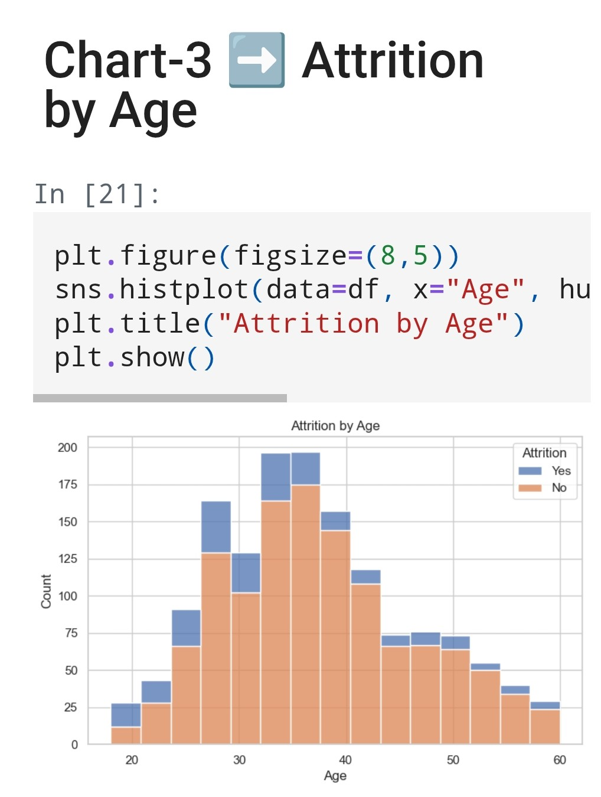  

*Attrition counts (Yes/No) by Age*  

# Attrition by Department:  

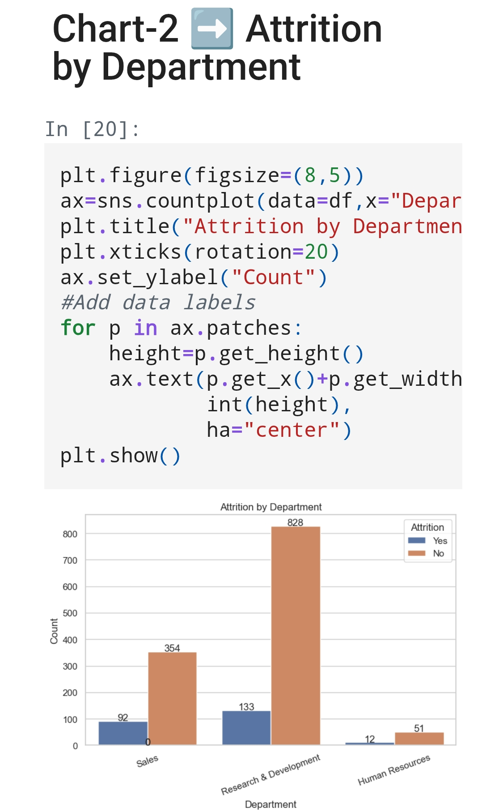  

*Attrition counts (Yes/No) per Department*  

# Attrition % by Job Role:  

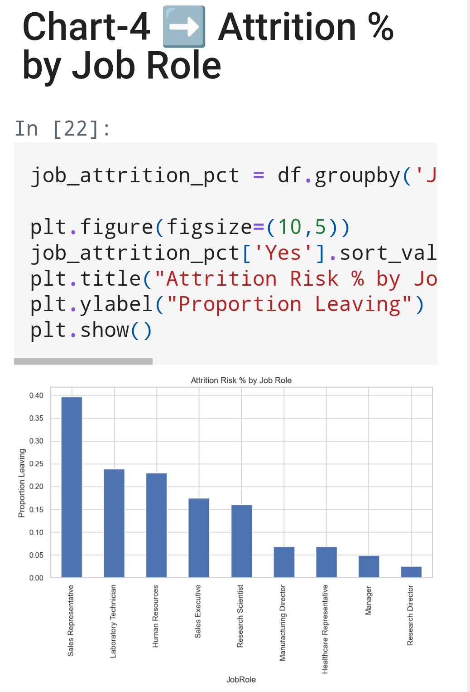  

*Percentage of employees leaving by Job Role*  

### Predictive Analytics (v2.0)  
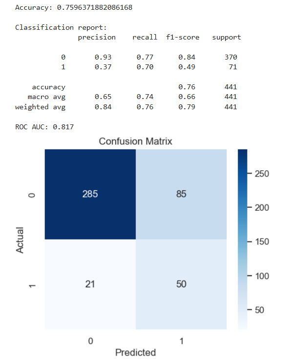  
*Confusion Matrix — Logistic Regression performance*  

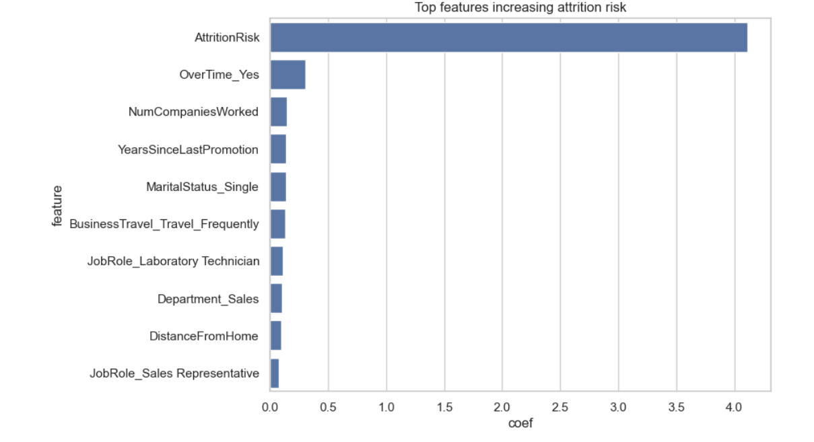  
*Top 10 features influencing attrition risk* 

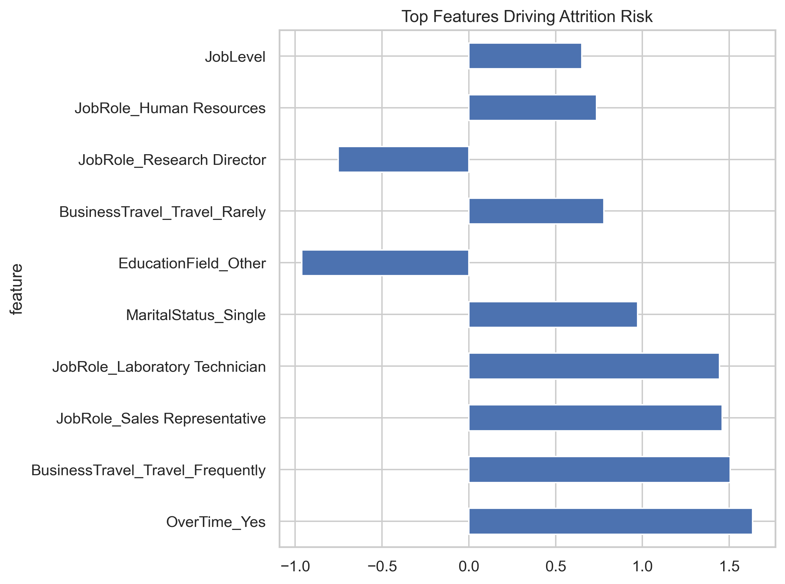  
*Top 10 features influencing attrition risk - Enhanced Model*

---

## 🔍 Key Insights  

- Overall attrition rate: **16.1%**  
- Job roles with highest attrition:  
  - Sales Representatives → 39% attrition (83 out of 220 left)  
  - Laboratory Technicians → 23% attrition (62 out of 259 left)  
- Lowest attrition: **R&D (13.8%)** → strongest retention  
- Highest attrition: **Sales (20.6%)** → weakest retention  
- HR is small (63 employees), but attrition rate is relatively high (19%)  
- Age groups younger than ~30 show elevated risk compared to older cohorts  

**From Predictive Model:**  
- Logistic Regression achieved ~`75.9%` accuracy, ROC-AUC = `0.817`.  
- Key positive attrition drivers: *Overtime, JobRole_SalesRep, MaritalStatus_Single, etc.*  
- Key retention drivers: *JobLevel, YearsAtCompany, MonthlyIncome*. 

---
## Project 2- Predictive Attrition Model (v3.0) - Tuned Models

**Objective:**  
Enhance the baseline Logistic Regression model by applying **cross-validation** and **hyperparameter tuning** to improve stability and interpretability.  

**Key Steps:**  
1. Split dataset into training & test sets (80/20)  
2. Standardized numeric features with `StandardScaler`  
3. Trained baseline Logistic Regression (Day-5)  
4. Applied **5-fold cross-validation** to validate performance consistency  
5. Used **GridSearchCV** to tune hyperparameters (`C`, `penalty`, `solver`)  
6. Compared tuned vs baseline performance  

**Results:**  
- Baseline Accuracy: **XX%**  
- Tuned CV Accuracy: **XX%**  
- ROC AUC: **XX**  
- Best Parameters: `{ 'C': X, 'penalty': 'l1', 'solver': 'liblinear' }`  

**Sample Visuals:**  

Top Features Driving Attrition:  
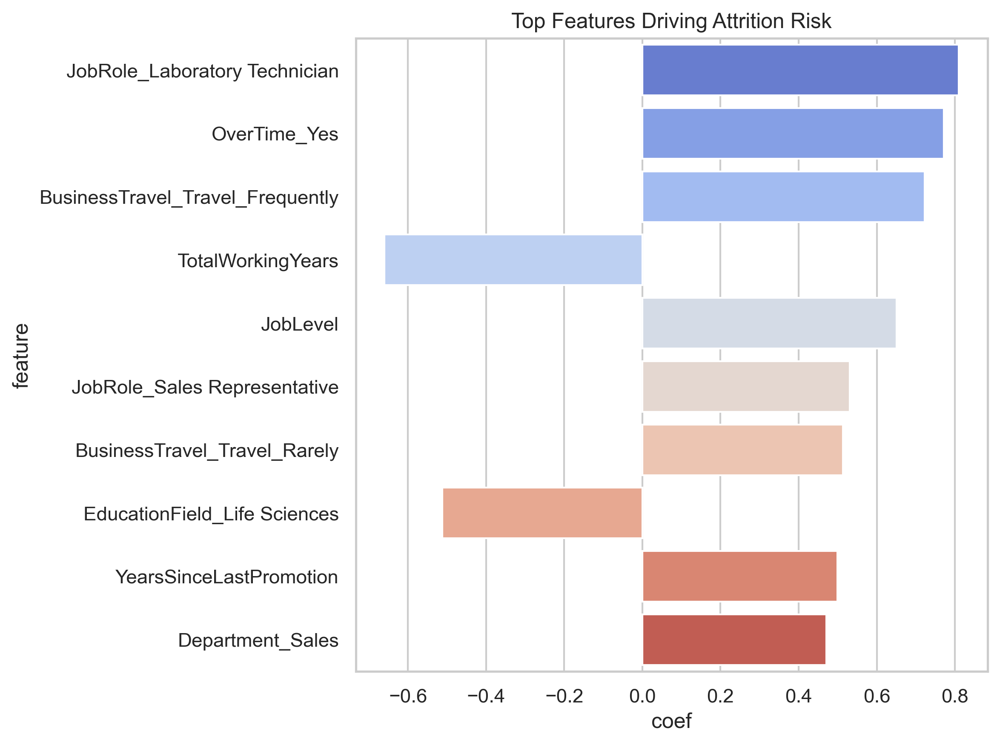  

**Insights:**  
- OverTime, Laboratory Technician roles, and Frequent Travel rank as top predictors.  
- Hyperparameter tuning improved model generalization, reducing overfitting risk.  
- Cross-validation confirmed stability of results across folds.
**Model Artifacts:**  
[logistic_top_features.csv](data/logistic_top_features.csv)
  
📓 [View the Predictive Notebook](notebooks/Attrition_PredictiveModel_V3.ipynb)

---

## 📊 Project 3: HR Data Cleaning Utility (v1.0) (Side Quest-1)

This notebook demonstrates how to **simulate messy HR data** and then build a cleaning pipeline to make it analysis-ready.  
Data cleaning is a critical step in People Analytics — poor quality data = misleading insights.
# ✅ Conclusions

- Automated pipeline successfully cleaned the dataset.  
- Issues fixed: duplicates, missing values, inconsistent casing, invalid dates.  
- Outputs saved in:
  - [messy_hr_data.csv](data/messy_hr_data.csv)  
  - [cleaned_hr_data.csv](data/cleaned_hr_data.csv)  

**Hero Visual: Data Cleaning Impact**  

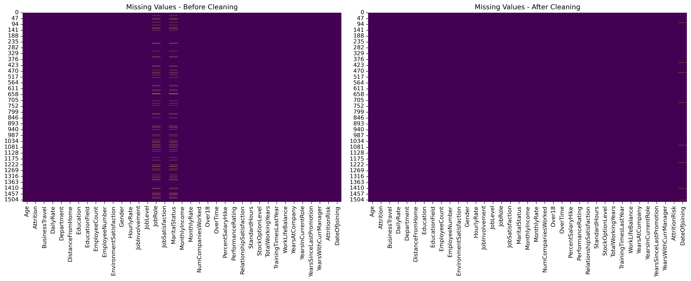

📓 [View the Utility Notebook](sidequests/HR_Data_Cleaning_Utility_V1.ipynb)  


## 📊 Project 4: Attrition Model Comparison (v3.0)

**Objective:**  
Benchmark **Logistic Regression** against a **Random Forest classifier** to see if tree-based models improve prediction of employee attrition.

**Key Steps:**  
1. Prepared dataset with clean features (no leakage)  
2. Trained baseline Logistic Regression (linear, interpretable)  
3. Trained Random Forest (non-linear, ensemble)  
4. Compared performance using Accuracy & ROC AUC  
5. Visualized confusion matrices and feature importance  

**Results:**  
- Logistic Regression → Accuracy: **75%**, ROC AUC: **79%**  
- Random Forest → Accuracy: **83%**, ROC AUC: **77%**  
- Random Forest showed stronger performance on non-linear features, while Logistic remains more interpretable.  

**Sample Visuals:**  
Confusion Matrix Comparison:  
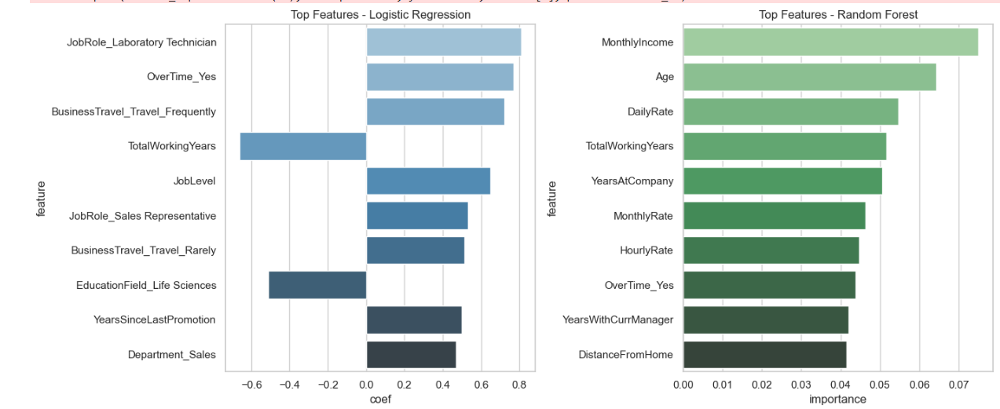  

Top Features (Logistic vs Random Forest):  
- Logistic: OverTime, SalesRep role, MaritalStatus=Single  
- Random Forest: OverTime, MonthlyIncome, Age buckets  
📓 [View the Model Comparison Notebook](notebooks/Attrition_ModelComparision.ipynb)

---

**Model Artifacts:**  
***Check Below for all Artifacts*** 
---

**Insights:**  
- Logistic = simple, transparent model (good for executive storytelling)  
- Random Forest = higher accuracy, captures complex patterns (good for prediction)  
- Next: try **XGBoost** and add **SHAP interpretability** for business-ready insights.

---

## 📊 Project 5: Advanced Attrition Models (Tuned RF + XGBoost)

**Objective:**  
Take predictive modeling beyond Logistic Regression by tuning Random Forest and introducing **XGBoost**, a gradient boosting algorithm widely used for structured/tabular datasets.  

---

**Key Steps:**  
1. Prepared dataset with cleaned features (no leakage).  
2. Trained and tuned Random Forest (grid search for depth, estimators, features).  
3. Trained XGBoost model with optimized hyperparameters.  
4. Compared model performance against Logistic Regression baseline.  
5. Visualized feature importances, ROC curves, and confusion matrices.  
6. Exported key data artifacts (top features, comparison metrics).  

---

**Results (Test Set):**  
- Logistic Regression → Accuracy: **75.2%**, ROC AUC: **0.798**  
- Tuned Random Forest → Accuracy: **83.7%**, ROC AUC: **0.769**  
- XGBoost → Accuracy: **86.4%**, ROC AUC: **0.774**  

---

### 🔥 Sample Visuals  

**1. ROC Curve Comparison (Logistic vs RF vs XGBoost)**  
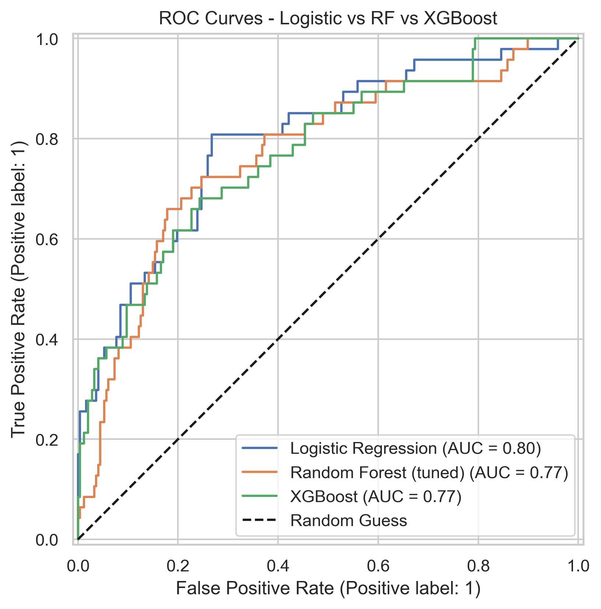  
📈 *Shows how Logistic, RF, and XGBoost trade off sensitivity vs specificity — XGBoost edges ahead on balance.*  

**2. Model Comparison (Accuracy vs ROC AUC)**  
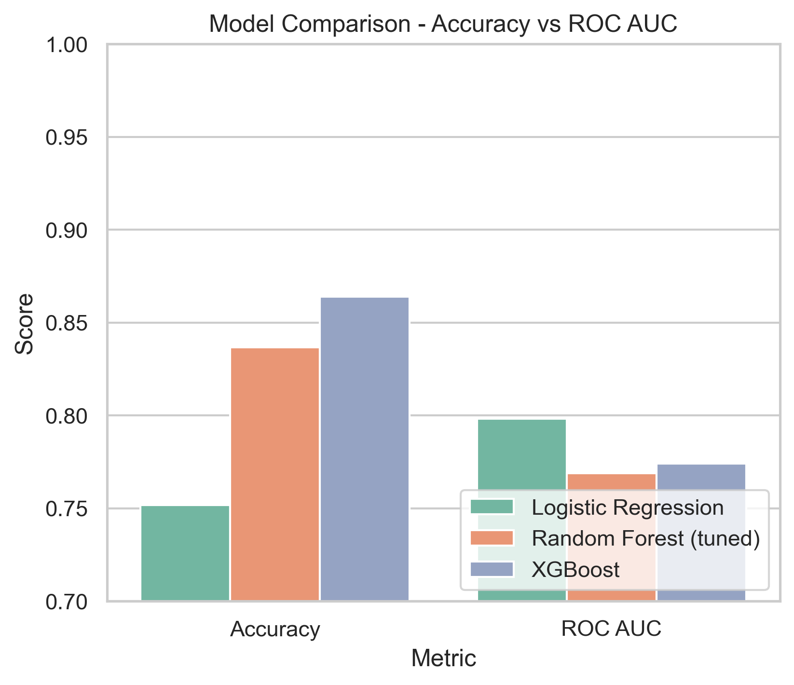  
📊 *Side-by-side accuracy vs ROC AUC highlights overall performance differences across models.*  

**3. Top Features (XGBoost Heatmap)**  
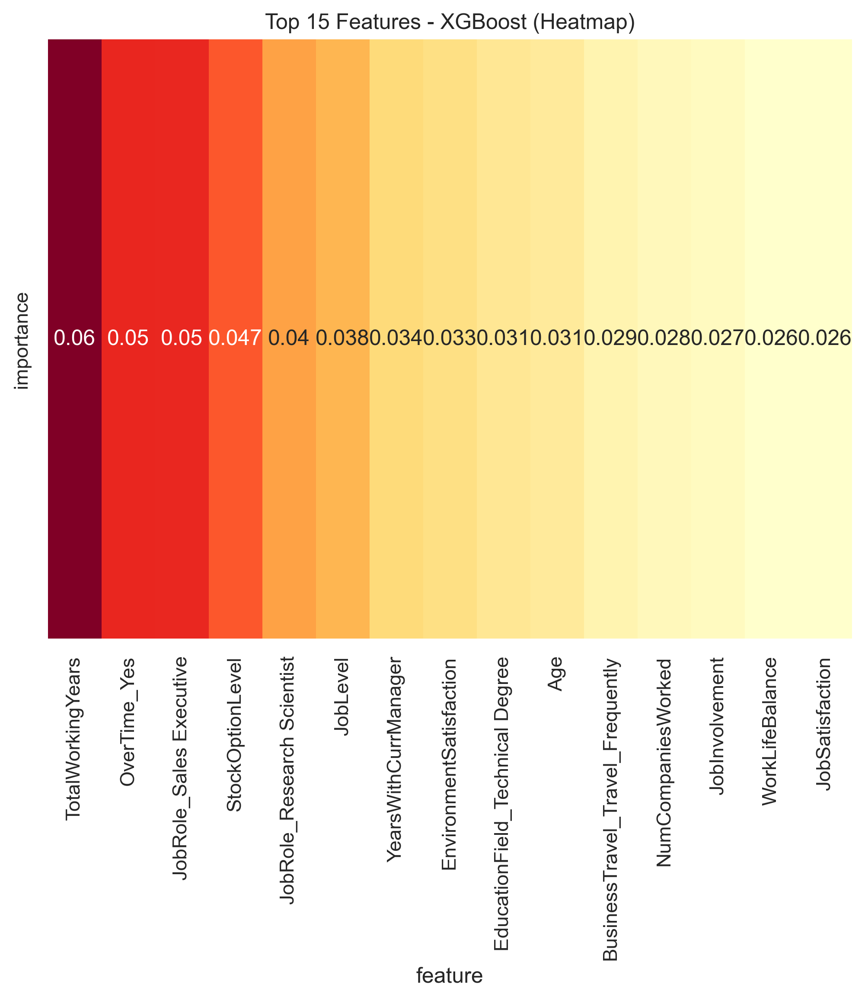  
🔥 *Top 15 features by importance — OverTime, JobRole, and MonthlyIncome dominate attrition risk signals.*  

**4. Confusion Matrix (XGBoost)**  
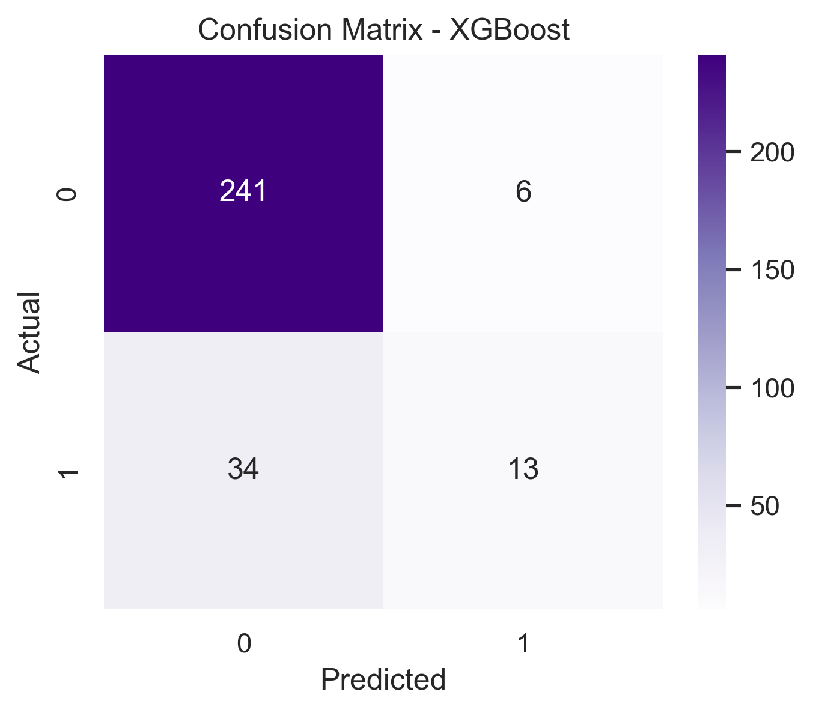  
🧩 *Visual breakdown of predictions — where XGBoost gets it right (and where it misses).*  

---
### Notebook 📓 [Attrition_AdvancedModels.ipynb → Advanced Models (RF + XGBoost)](notebooks/Attrition_AdvancedModels.ipynb)  
---
### 📦 Data Artifacts

- [rf_top_features.csv](data/rf_top_features.csv)  
- [xgb_top_features.csv](data/xgb_top_features.csv)  
- [model_comparison_results.csv](data/model_comparison_results.csv)
---
**Insights:**  
- Logistic Regression: strong interpretability but weaker predictive power.  
- Random Forest: higher accuracy (84%), robust to non-linearities.  
- XGBoost: best performer overall (86% accuracy), consistently picks up complex patterns (OverTime, MonthlyIncome, JobRole).  
---
**Next Steps:**  
- Add **SHAP interpretability** for XGBoost.  
- Deploy best model in a **Streamlit dashboard**.  
- Integrate SQL + ML for end-to-end HR analytics workflows.
---
## 📊 Project 6: Model Explainability with SHAP

**Objective:**  
Use SHAP values to interpret XGBoost predictions, showing both global and local drivers of attrition.  

---

### 🔑 Key Steps  
1. **Load & preprocess data** → Dropped leakage columns, encoded categoricals, ensured numeric types.  
2. **Load trained XGBoost model** → From Project 5 (`xgboost_attrition_model.pkl`).  
3. **Subsample data (100 rows)** → Keeps SHAP efficient & avoids kernel crashes.  
4. **Compute SHAP values** → Using new `shap.Explainer` API.  
5. **Generate visuals**:  
   - Global feature importance & summary plots.  
   - Local explanations (waterfall + bar).  
   - Dependence plot for feature interactions.  
6. **Export artifacts** → Saved plots in `/images/` for portfolio clarity.  

---

### 📈 Results  
- **Global Drivers:**  
  - Age, Distance from Home, and Daily Rate (Compensation )are the most influential features.  
- **Local Explanations:**  
  - For an individual employee, SHAP shows exactly which features push their attrition risk up or down.  
- **Feature Interactions:**  
  - Dependence plots reveal how attrition risk rises at lower income bands and with frequent overtime.  
- **Takeaway:**  
  - Moves the model from “black box” → **explainable AI**, building trust with HR leaders.  

---

### 🔥 Sample Visuals  

**1. SHAP Summary Plot (Global Drivers)**  
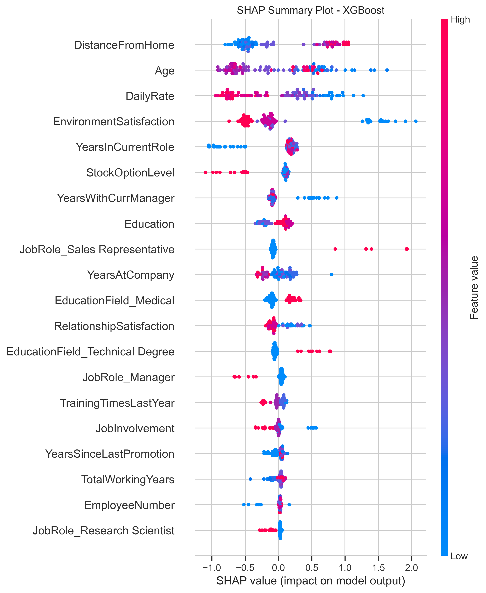  
🌍 *Shows which features consistently drive attrition across the workforce.*  

**2. SHAP Feature Importance (Bar Plot)**  
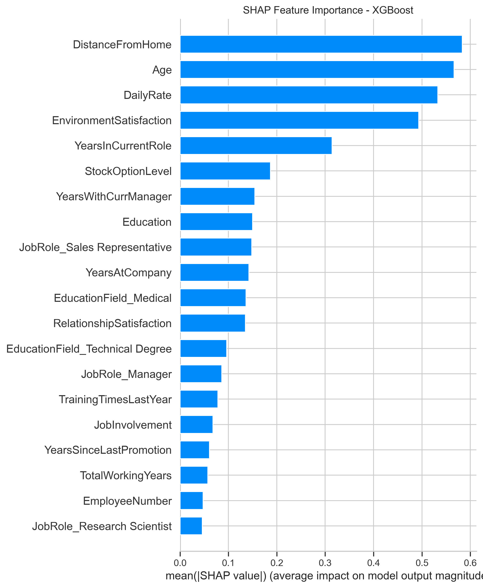  
📊 *Highlights top features by mean absolute SHAP value — OverTime, JobRole, and MonthlyIncome dominate.*  

**3. SHAP Local Explanations (Individual Employee)**  
- Waterfall Plot: 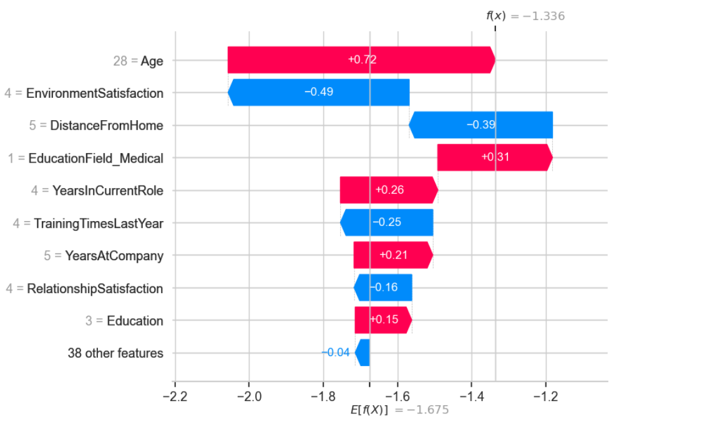  
- Bar Plot: 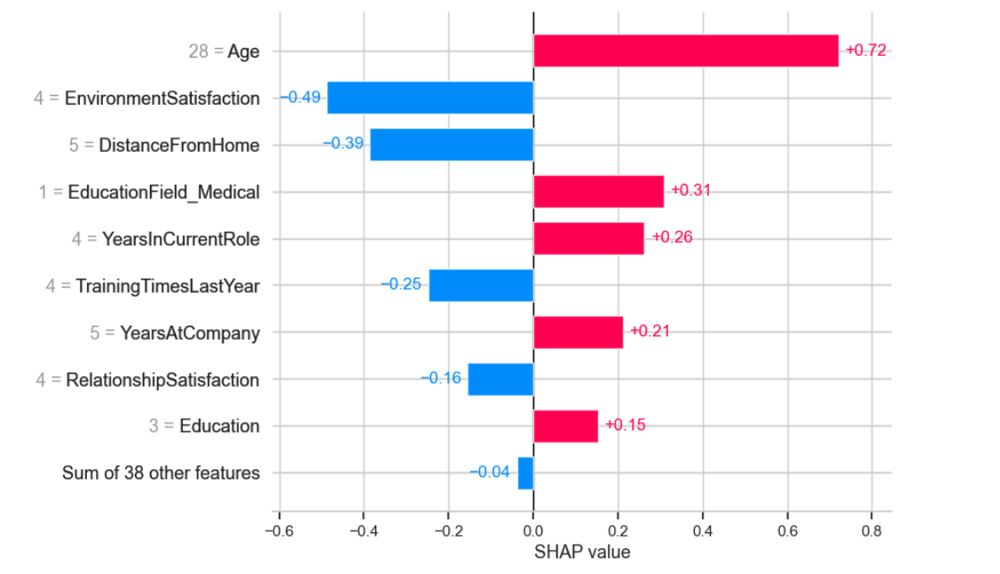  
👤 *Explains why one specific employee is predicted as at-risk, showing top contributing features.*  

**4. SHAP Dependence Plot (MonthlyIncome)**  
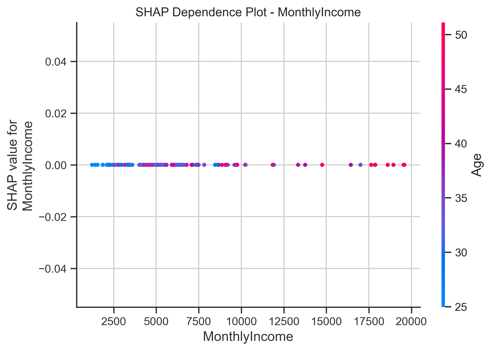  
🔀 *Shows how attrition risk changes with MonthlyIncome while interacting with other features.*  

---

### 📓 Notebook  
- [Attrition_ModelExplainability.ipynb](Attrition_ModelExplainability.ipynb)  
---

### 📦 Artifacts  
- [xgboost_attrition_model.pkl](models/xgboost_attrition_model.pkl)  
- Visuals:  
  - [shap_summary_plot.png](images/shap_summary_plot.png)  
  - [shap_feature_importance.png](images/shap_feature_importance.png)  
  - [shap_waterfall_plot.png](images/shap_waterfall_plot.png)  
  - [shap_local_bar_plot.png](images/shap_local_bar_plot.png)  
  - [shap_dependence_plot.png](images/shap_dependence_plot.png)
---
### ✅ Conclusions  
- **Global Drivers:** Overtime, Job Role, and Monthly Income stand out as top predictors.  
- **Local Explanations:** Individual-level SHAP plots build confidence in predictions.  
- **Feature Interactions:** Dependence plots highlight nuanced patterns beyond simple correlations.  

**Why this matters:**  
- SHAP adds transparency → critical for HR applications where fairness & accountability are key.  
- Executives can see not just *who* is at risk, but *why*.  
- Enhances business trust in predictive HR analytics.  

---
## 📊 Project 7: Interactive Attrition Dashboard (Streamlit)

**Objective:**  
Deploy an interactive web app where HR leaders can upload data, run attrition predictions, and explore explainability visuals.

---

### 🔑 Key Steps  
1. Built a **Streamlit app (`app.py`)** to host trained models (Logistic, RF, XGBoost).  
2. Created `trained_columns.pkl` for consistent feature alignment during predictions.  
3. Added upload functionality → users can test with their own HR datasets (CSV).  
4. Integrated SHAP for **global & local explanations** inside the dashboard.  
5. Deployed app on **Streamlit Cloud** → shareable public link.  

---

### 📈 Results  
- End-to-end ML workflow is now **live & interactive**.  
- Users can:  
  - Upload data  
  - Select model  
  - View predictions + probabilities  
  - Explore explainability plots  
- Moves this portfolio from **static analysis → deployable HR Tech product**.  

---

### 🖼️ Sample Images  

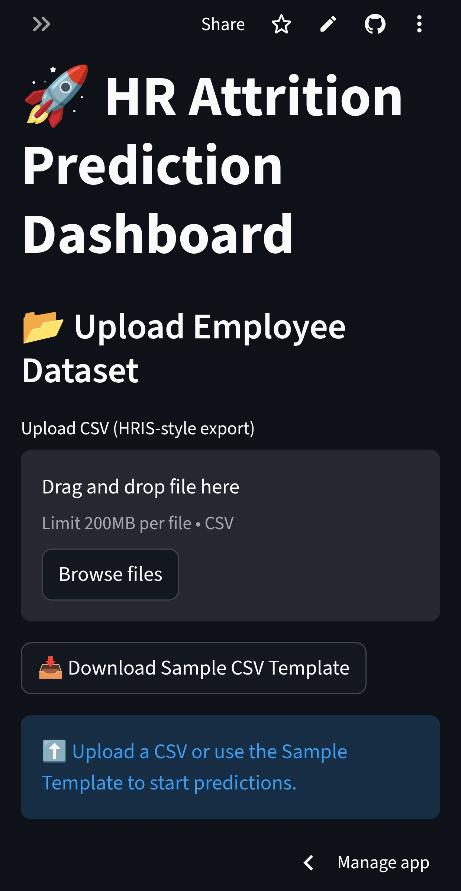

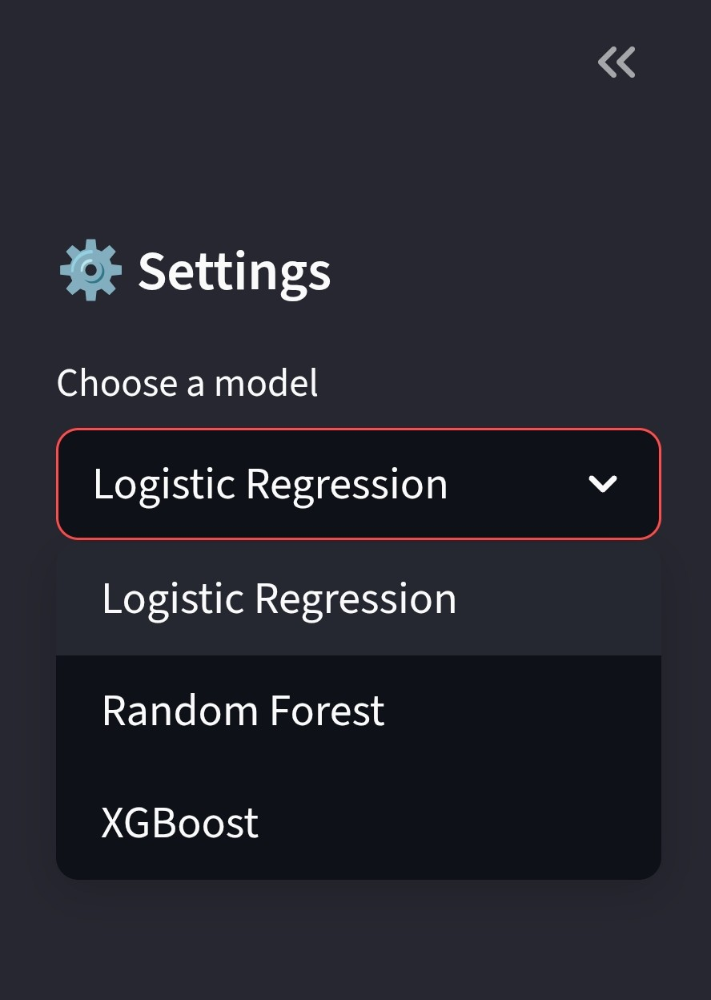

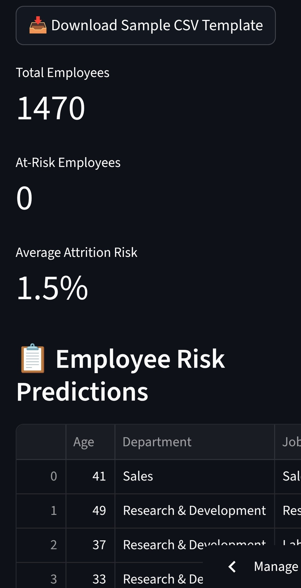

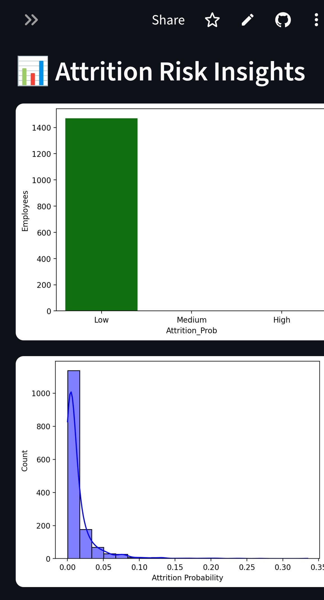
  

---

### 🌍 Live App  
- [Open Dashboard](https://hr-tech-portfolio.streamlit.app/)  

---

### 📂 Files  
- [app.py](app.py) → main dashboard app  
- [trained_columns.joblib](models_joblib/trained_columns.joblib) → ensures feature alignment 
- [requirements.txt](requirements.txt) → dependencies for deployment  

---

### ✅ Conclusions  
- Streamlit deployment shows the ability to go beyond notebooks and create **real-world HR tools**.  
- Adds credibility for consulting/analytics roles by showcasing full-stack delivery.  
- Sets foundation for future dashboards (Compensation, SQL+ML, etc.).  

---

### 🚀 Next Steps  
- Build **SQL + ML pipeline** to query databases + run predictions (Project 8).  
- Extend dashboard with **Compensation Analytics** modules.
## 📊 Project 8: SQL + ML Integration  

**Objective:**  
Bridge **SQL querying power** with **Machine Learning predictions** for HR attrition risk.  
This project shows how HR teams can query their employee database (like an HRIS system) and instantly run ML predictions on the results.  

**Why It Matters (Business Context):**  
- HR data lives in **databases** (HRIS, payroll, ERP).  
- Analysts need the ability to query + predict attrition directly.  
- This integration makes predictive analytics **practical in enterprise settings**.  

---

### 🔑 Key Steps  
1. **Database Creation** → Converted IBM dataset → SQLite DB (`hr_dataset.db`) with `employees` table.  
2. **Helper Scripts** →  
   - [`helper_scripts/hr_db.py`](helper_scripts/hr_db.py) → builds DB from CSV.  
   - [`helper_scripts/sql_utils.py`](helper_scripts/sql_utils.py) → safe query execution + sample queries.  
3. **SQL Queries** → Run HR-style queries (e.g., attrition by department, tenure distribution).  
4. **ML Integration** → Query results → feature alignment → scaled → predictions using trained XGBoost model.  
5. **Visuals** → Donut chart (Safe vs At Risk), Department stacked bars, Probability distribution.  
6. **Optimized Predictions** →  
   - Leakage fix (drops `Attrition` col).  
   - Proper scaling.  
   - Tuned threshold (`0.65`) for realistic at-risk counts.  

---

### 🖼️ Sample Visuals  

**Donut Chart — Attrition Risk Split**  
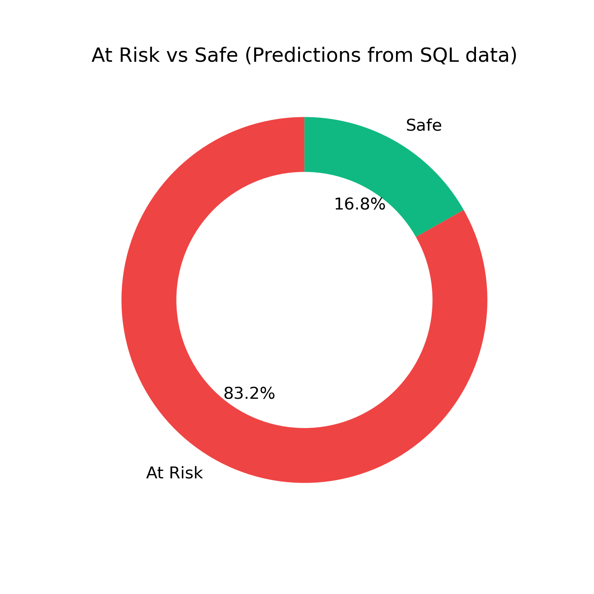  

**Department Breakdown**  
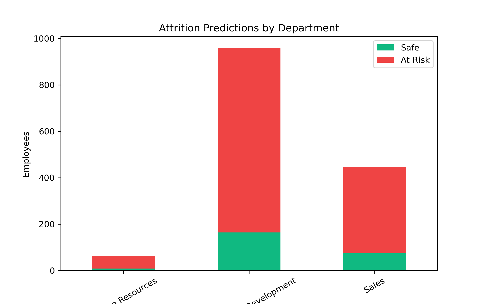  

**Predicted Attrition Probability Distribution**  
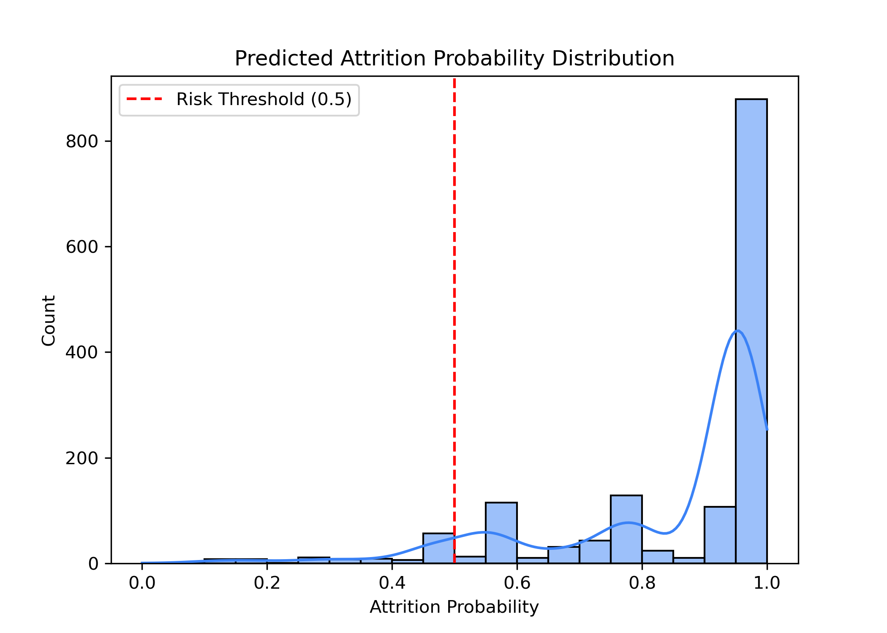  

---

### 📦 Artifacts  

- **Notebook** → [Attrition_SQL_Integration-Git.ipynb](notebooks/Attrition_SQL_Integration-Git.ipynb)  
- **Database** → [hr_dataset.db](data/hr_dataset.db)  
- **Dataset** → [employee_attrition.csv](data/employee_attrition.csv)  
- **Helper Scripts** → [`helper_scripts/`](helper_scripts/)  
- **Predictions Export** → [Attrition_SQL_Predictions.csv](data/Attrition_SQL_Predictions.csv)  

---

### ✅ Conclusion  

- SQL + ML pipeline works end-to-end.  
- Analysts can run **attrition queries directly on DB** and immediately see predictions.  
- Departments with high predicted risk can be flagged for **retention interventions**.  

**Way Forward:**  
- Expand SQL query library (e.g., gender pay parity, tenure buckets).  
- Connect to **real HRIS / cloud DB** instead of static CSV.  
- Build a Streamlit **C&B Dashboard** (next side quest).

---

## 📊 Project 9 (Sidequest 2): Compensation & Benefits Dashboard

An executive-grade **HR Analytics & Insights App** built with **Streamlit** — delivering real-time pay analytics, **AI-powered chatbot querying**, automated **board-ready PDF exports**, and **smart session persistence**.

📂 [View Dashboard Artifacts & Documentation](./cb_dashboard_artifacts/README.md)  
🔗 [Launch Live App on Streamlit](https://cb-dashboard.streamlit.app)

---

### 🎯 Objective
To build a **Compensation & Benefits analytics system** that enables HR leaders to explore data conversationally, benchmark pay structures, and auto-generate boardroom reports — entirely within Streamlit.

---

### 💼 Why It Matters (Business Context)
- Compensation is the **largest cost driver (≈70% of HR OPEX)** in organizations.  
- Business heads need **rapid, narrative-ready insights** on fairness, bonus dispersion, and competitiveness.  
- This app bridges analytics and storytelling — turning complex HR data into **explainable visuals + executive summaries**.

---

### 🔑 Key Features

#### 🧩 Data & Setup
- Upload **Internal** and **Benchmark** datasets (CSV/XLSX).  
- **Header validation** ensures HRIS alignment.  
- Define job level hierarchy interactively with dropdown sequencing.  

#### 🧠 Smart Analytics Engine
- **Session Memory System** — auto-saves state, restores prior configurations seamlessly.  
- **Auto-report generation** with consolidated visuals and summaries.  
- **7 Core Metrics**:
  - Avg & Median CTC  
  - Bonus % of CTC  
  - Quartile Distribution  
  - Gender Pay Gap  
  - Performance & Pay Correlation  
  - Market Benchmarking  
  - Distribution Insights by Role  

#### 💬 AI Chatbot Assistant *(Sidequest 3 Integration)*
- Conversational HR analytics powered by natural language queries.  
- Generates instant text + visual responses (“What’s the gender pay gap for Managers?”).  
- Supports job level, department, and rating filters for precise insights.  

#### 📘 Reporting & Visualization
- **Automated PDF Exports**: User Guide + Executive Summary Reports.  
- **Zebra-styled tables**, **dark mode charts**, and **HR brand layout**.  
- Dynamic images auto-saved to `/cb_dashboard_artifacts/images/`.  

---

### 📈 Results (v5.0 — Executive Edition)
| Aspect | Highlights |
|:--|:--|
| **Interface** | Matte dark-mode layout with motion & badge polish |
| **Chatbot** | Conversational analytics, HR query-to-visual conversion |
| **Persistence** | Multi-layer memory — save, auto-save, auto-restore |
| **PDF Engine** | Dual-mode WeasyPrint + ReportLab generation |
| **Deployment** | Streamlit Cloud, mobile-tested, artifact-linked |
| **Structure** | `/data`, `/images`, `/exports` + dedicated README |

---

### 📂 Artifacts
| File | Description |
|------|--------------|
| [`cb_dashboard.py`](https://github.com/AMBOT-pixel96/hr-tech-portfolio/blob/main/cb_dashboard.py) | Core dashboard logic |
| [`cb_dashboard_artifacts/`](./cb_dashboard_artifacts/) | Data, visuals, PDFs, and app documentation |
| [`requirements.txt`](https://github.com/AMBOT-pixel96/hr-tech-portfolio/blob/main/requirements.txt) | Dependencies for deployment |

---

### ✅ Conclusions
- Combines **C&B domain expertise** with **AI-enabled HR Tech engineering**.  
- Operates fully on Streamlit — **no Django/Flask backend** — mobile + cloud compatible.  
- Demonstrates end-to-end product thinking: data → insight → narrative → PDF.  
- Represents a **SaaS-grade HR Intelligence Tool** built solo, in a single-day sidequest.  

---

## 📊 Project 10: Attrition Explainability with SHAP (v1.0)

**Objective:**  
Enhance interpretability of advanced attrition models (Random Forest / XGBoost) using **SHAP** values.  
This project makes the “black box” models explainable, showing **which features drive attrition** at both global (all employees) and local (individual employee) levels.  

**Why This Matters (Business Context):**  
- Executives need to know not just *who* is at risk, but *why*.  
- SHAP (SHapley Additive exPlanations) builds trust by linking predictions to actionable factors.  
- Transparency ensures fairness in HR decisions and strengthens adoption of predictive analytics.  

### 🔑 Key Steps
1. Loaded trained model + aligned dataset (clean features, leakage removed).  
2. Generated **SHAP Summary Plot** → top global drivers of attrition.  
3. Built **Top 15 Feature Importance (Bar Plot)** for easy business readability.  
4. Exported **full feature importance table (44 features)** to CSV for reference.  
5. Created **Dependence Plot** (MonthlyIncome vs Attrition risk).  
6. Generated **Local Waterfall Plot** → explains why one employee was flagged “At Risk.”  
7. Saved all charts + artifacts for portfolio showcase.  

### 📈 Results
- **Global Drivers:** Age, DailyRate, MonthlyIncome, OverTime consistently top predictors.  
- **Top 15 Features:** Captured ~80% of SHAP importance (clear drivers visible in business plots).  
- **Local Explanation:** Waterfall plots show *exactly which factors push an individual into attrition risk*.  
- **Artifacts Exported:** All visuals and CSV available for download.  

### 🖼️ Visuals
- [SHAP Summary Plot (Global)](images/shap_summary_plot_v2.png) 🌍  
- [Top 15 Feature Importance (Bar)](images/shap_feature_importance_top15.png) 📊  
- [SHAP Dependence Plot — MonthlyIncome](images/shap_dependence_plot_v2.png) 💰  
- [Local SHAP Waterfall (Employee 0)](images/shap_waterfall_employee0.png) 👤  

### 📦 Artifacts
- **Data File:** [`shap_feature_importance_full.csv`](data/shap_feature_importance_full.csv) → full table of all 44 features with mean SHAP values.  
- **Images:**  
  - SHAP Summary Plot (Global)  
  - Top 15 Feature Importance (Bar)  
  - SHAP Dependence Plot — MonthlyIncome  
  - Local SHAP Waterfall (Employee 0)
---

📓 [View the Notebook → Attrition_SHAP_Explainability_V1.ipynb](notebooks/Attrition_SHAP_Explainability_V1.ipynb)  

---

### ✅ Conclusion
- Project 10 brings **explainable AI** to the HR Attrition domain.  
- Moves beyond prediction → **interpretation**.  
- Business users now get *clear charts* + *tables* linking model predictions to real HR actions.

---

## 📊 Project 11: Compensation Analytics (Seed – Day 2)

**Objective:** Start building compensation analytics fundamentals (stepping stone to the full **C&B Dashboard v2.0**).  
Analyzed employee compensation dataset to practice salary distribution, bonus %, and gender gap visuals.

**Key Steps:**
1. Loaded a synthetic compensation dataset (`employee_compensation_sample.csv`).
2. Computed:
   - Average CTC by Job Level
   - Bonus % of CTC
   - Gender pay gap % (Male vs Female).
3. Exported processed datasets + visualizations.
4. Pushed artifacts to GitHub **directly from Colab** 🔥 (*No Sheep Arc milestone*).

### 📦 Artifacts
- Data: [Comp_Analytics_Processed.csv](data/Comp_Analytics_Processed.csv)  
- Images:  
  - Avg CTC by Job Level (📊 Bar Chart)  
  - Bonus % Distribution (🎁 Bar Chart)  
  - Gender Pay Gap (👫 Grouped Bars)
---

### 🔥 Sample Visuals

**1. Average CTC by Job Level**  
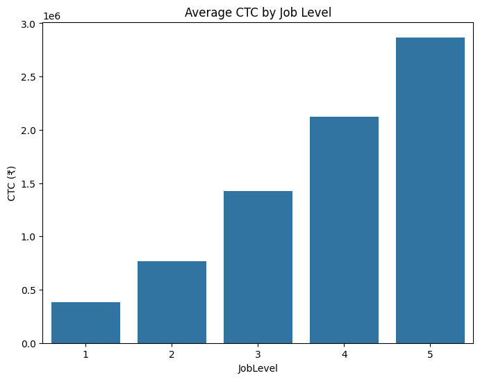

**2. Bonus % Distribution by Job Level**  
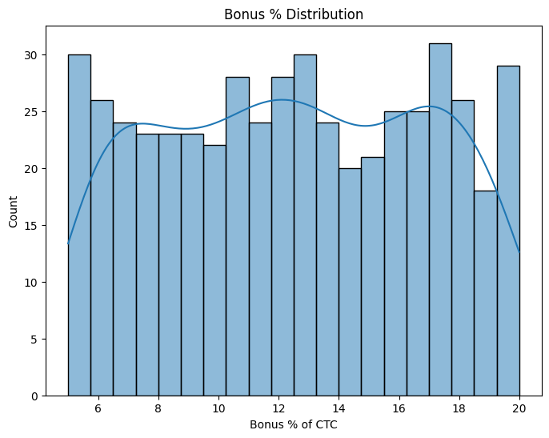

**3. Gender Pay Gap (Male vs Female, % Difference)**  
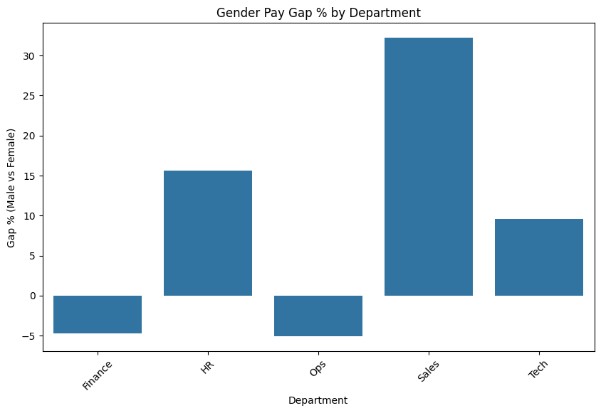
---

📓 Notebook: [Compensation_Analytics_V1.ipynb](notebooks/Compensation_Analytics_V1.ipynb)

---

✅ **Status:** Seed project complete — lays the foundation for **Project 10 (C&B Dashboard 2.0)**.

---
## 📊 Project 12: Compensation Analytics (Day 3 – Extension V2)

**Objective:** Extend seed compensation analytics with **median CTC**, **department-level insights**, and **bonus % distribution**.  
This iteration builds stronger analytical foundations, preparing for **C&B Dashboard v2.0**.

---

### 🔑 Key Steps
1. **Median CTC by Job Level**  
   - Calculated medians (not just averages).  
   - Visualized with boxplot.  
   - Exported → `comp_median_ctc.csv` + `comp_median_ctc.png`.  

2. **Department-Wise Pay Comparison**  
   - Grouped mean & median side by side.  
   - Visualized as grouped bar chart.  
   - Exported → `comp_ctc_by_department.csv` + `comp_ctc_by_dept.png`.  

3. **Bonus % Distribution by Department**  
   - Analyzed bonus share by department.  
   - Visualized with violin plot.  
   - Exported → `bonus_by_department.csv` + `bonus_by_department.png`.  

4. **Artifact Push**  
   - Notebook & outputs tracked in Git.  

---

### 🖼️ Visuals  

**1. Median CTC by Job Level**  
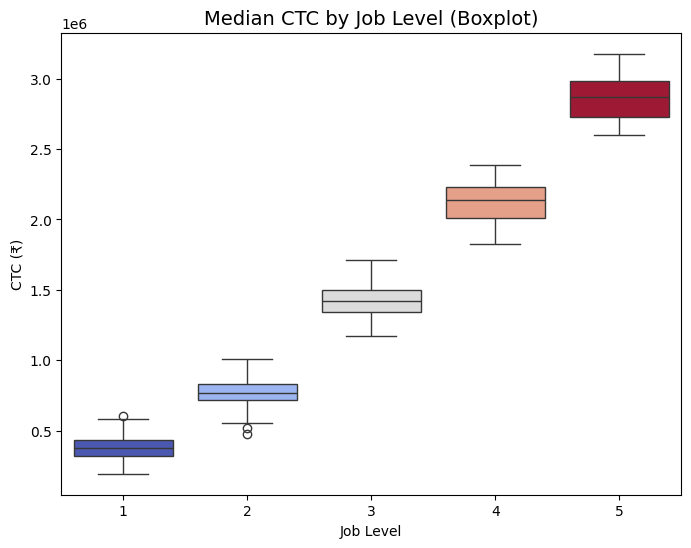  

**2. CTC by Department (Mean vs Median)**  
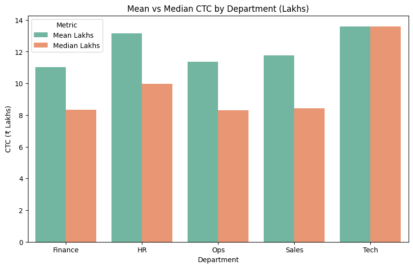  

**3. Bonus % Distribution by Department**  
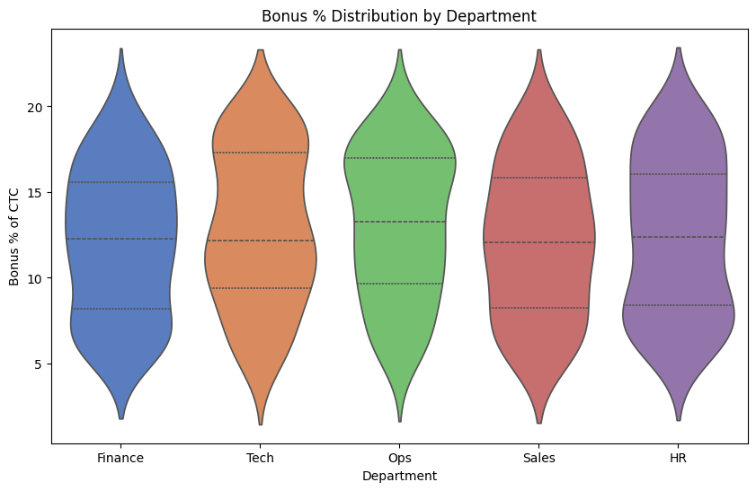  

---

### 📦 Artifacts  
- [comp_median_ctc.csv](data/comp_median_ctc.csv)  
- [comp_ctc_by_department.csv](data/comp_ctc_by_department.csv)  
- [bonus_by_department.csv](data/bonus_by_department.csv)  

---
📓 Notebook: [Compensation_Analytics_V2.ipynb](notebooks/Compensation_Analytics_V2.ipynb)  

---

✅ **Status:** Polished extension complete — sets stage for **C&B Dashboard v2.0**.

---

## 📊 Project 13: Compensation Analytics
(V3 - Bonus vs CTC, Gender Gap, Dept Pay)

**Objective:** Extend compensation analytics by adding **bonus vs performance**, **gender pay gap**, and **departmental averages**. 

---

### 🔑 Key Steps
1. **Bonus % vs Performance**  
   - Derived `BonusPct = Bonus ÷ CTC × 100`.  
   - Grouped by Performance bands.  
   - Exported → `day4_bonus_vs_perf.csv` + `day4_bonus_vs_perf.png`.

2. **Headcount by Job Level**  
   - Counted employees by `JobLevel`.  
   - Exported → `day4_joblevel_counts.csv` + `day4_joblevel_counts.png`.

3. **Departmental Averages**  
   - Grouped mean CTC by department.  
   - Exported → `day4_ctc_by_dept.csv` + `day4_ctc_by_dept.png`.

4. **Gender Pay Gap**  
   - Compared avg CTC between Male vs Female.  
   - Calculated pay gap % = (Male − Female)/Male × 100.  
   - Exported → `day4_gender_paygap.csv` + `day4_gender_paygap.png`.

---

### 🖼️ Visuals  

**1. Bonus % vs Performance**  
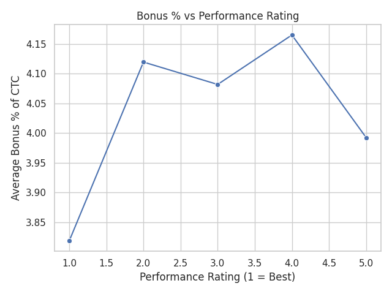  

**2. Headcount by Job Level**  
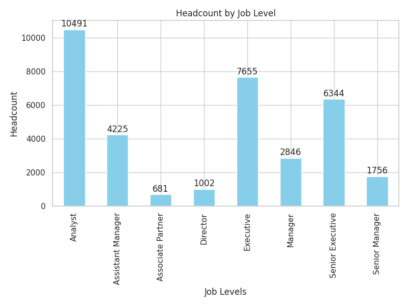  

**3. Avg CTC by Department**  
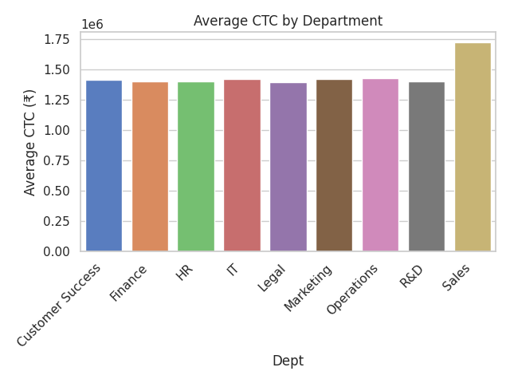  

**4. Gender Pay Gap**  
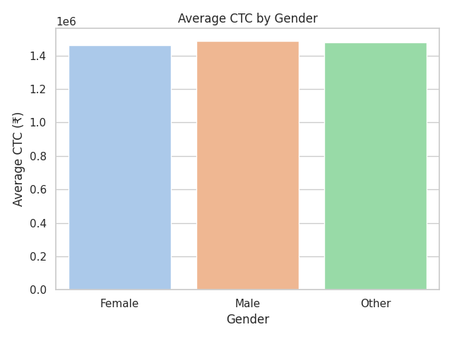  

---

### 📦 Artifacts  
- [day4_bonus_vs_perf.csv](data/day4_bonus_vs_perf.csv)  
- [day4_joblevel_counts.csv](data/day4_joblevel_counts.csv)  
- [day4_ctc_by_dept.csv](data/day4_ctc_by_dept.csv)  
- [day4_gender_paygap.csv](data/day4_gender_paygap.csv)  

---

📓 Notebook: [Compensation_Analytics_V3.ipynb](notebooks/Compensation_Analytics_V3.ipynb)  

---

✅ **Status:** Compensation analytics now spans **Seed (Day 2)** → **Extension (Day 3)** → **Bonus/Gender/Dept (Day 4)**, powering **C&B Dashboard v2.0**.

---
## 📊 Project 14: Compensation Analytics
(Day 5 – V4 Executive Insights)

**Objective:** Deliver consulting-grade, executive visuals: **gender gap by level**, **bonus distribution KDE**, and **quartile pay bands**.  

---

### 🔑 Key Steps
1. **Gender Pay Gap by Job Level**  
   - Compared Male vs Female avg CTC across levels.  
   - Exported → `day5_gender_gap_by_level.csv` + `day5_gender_gap_by_level.png`.  

2. **Bonus % KDE (by Department)**  
   - Kernel Density Estimation plot of BonusPct.  
   - Exported → `day5_bonus_kde.png`.  

3. **Quartile Pay Bands**  
   - Q1, Median, Q3, Max by JobLevel.  
   - Exported → `day5_ctc_quartiles.csv` + `day5_ctc_quartiles.png`.  

---

### 🖼️ Visuals  

**1. Gender Pay Gap by Level**  
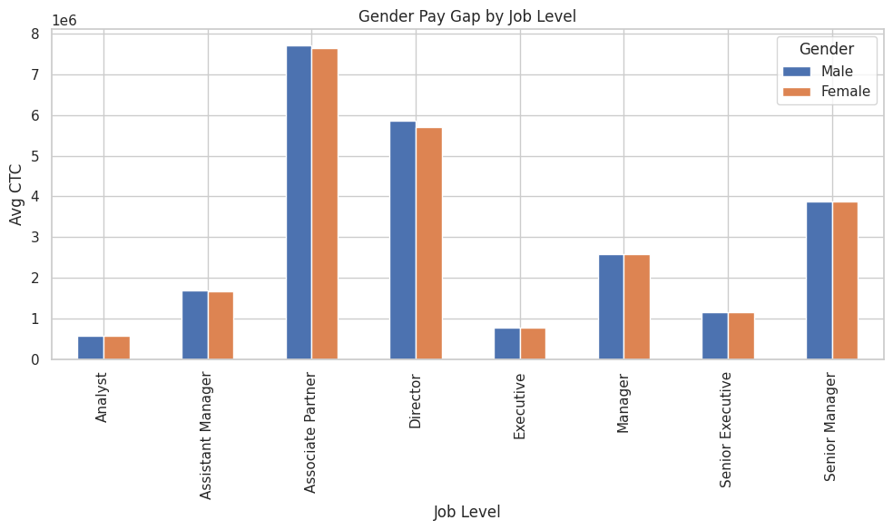  

**2. Bonus % KDE (by Dept)**  
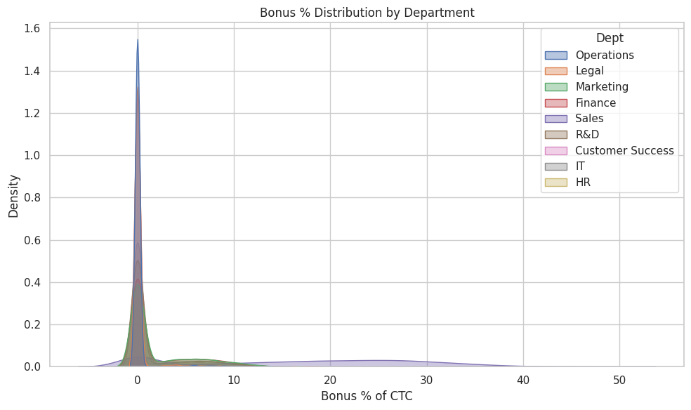  

**3. Quartile Pay Bands (CTC)**  
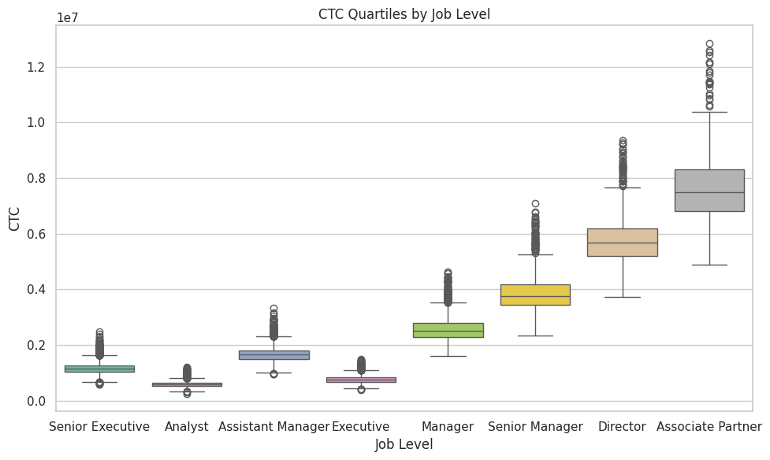  

---

### 📦 Artifacts  
- [day5_gender_gap_by_level.csv](data/day5_gender_gap_by_level.csv)  
- [day5_ctc_quartiles.csv](data/day5_ctc_quartiles.csv)  

---

📓 Notebook: [Compensation_Analytics_V4.ipynb](notebooks/Compensation_Analytics_V4.ipynb)  

---

✅ **Status:** With Day-5 complete, Compensation Analytics now spans **Seed → Extension → Bonus/Gender/Dept → Executive Insights**, powering **C&B Dashboard v2.0+**.

---

## ⚒️ Tech Stack  

- Python (Pandas, Matplotlib, Seaborn, scikit-learn, Jupyter Notebook)  
- SQL (SQLite for queries on HR dataset)
- Dataset: [IBM HR Analytics Attrition Dataset (Kaggle)](https://www.kaggle.com/datasets/pavansubhasht/ibm-hr-analytics-attrition-dataset)

---

## Model artifacts:(All Models)
- [logistic_attrition_model.pkl](models/logistic_attrition_model.pkl)
- [scaler.pkl](models/scaler.pkl)
- [logistic_attrition_model_tuned.pkl](models/logistic_attrition_model_tuned.pkl)
- [random_forest_attrition_model.pkl](models/random_forest_attrition_model.pkl)
- [random_forest_tuned.pkl](models/random_forest_tuned.pkl)  
- [xgboost_attrition_model.pkl](models/xgboost_attrition_model.pkl)

---

## 🛠️ How to Run This Project

Follow these steps to reproduce the analysis on your own system:

1. **Clone the repository**
   ```bash
   git clone https://github.com/AMBOT-pixel96/hr-tech-portfolio.git
   cd hr-tech-portfolio
2. **Create a virtual environment Using Conda:**
```bash
conda create -n hrtech python=3.10 -y
conda activate hrtech
```
3. **Install required packages**
```
pip install -r requirements.txt
```
4. Launch Jupyter Notebook

jupyter notebook


5. Open and run the notebooks


---

## 🚀 Upcoming Projects  

- Compensation Analytics Dashboard
- SQL query library for HR datasets (attrition by job role, tenure, etc.)  
- Feature engineering + cross-validation for predictive modeling.

---

## 🧑‍💻 About Me  

I’m exploring the intersection of **Compensation & Benefits, HR Tech, and People Analytics**.  
This repo is my hands-on portfolio — tracking progress as I move from HR practitioner → HR Tech consultant.  

---

⭐️ If you find this interesting, follow my journey here or connect with me on LinkedIn.

---

<!-- trigger: repo-tree -->

---
