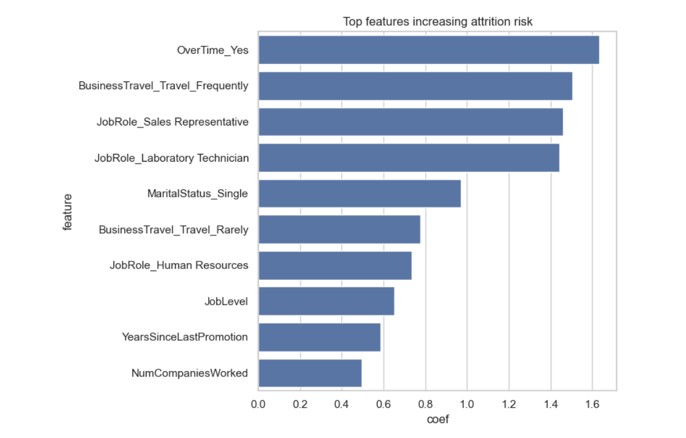

# HR Tech Portfolio  

  
  
  
  
  
  

This repository showcases my journey into **HR Tech & People Analytics**.

This repository showcases my journey into **HR Tech & People Analytics**.  
It contains hands-on projects where I apply **Python, Pandas, Seaborn, and People Analytics concepts** to real-world HR data.  

---

## 📊 Project 1: Attrition Risk Analyzer (v1.0)

### v1.0 — Descriptive Insights
**Objective:**  
Analyze IBM’s HR Attrition dataset to identify patterns of employee attrition, create a risk flag, and visualize insights.

---

**Why This Matters (Business Context):**  
Employee attrition directly impacts business costs through lost productivity, rehiring, and retraining.  
By identifying high-risk roles and departments, organizations can proactively design retention strategies,  
reduce turnover costs, and improve workforce stability.

---

**Key Steps:**  
1. Load and explore the dataset (1470 employees, 35 features).  
2. Analyze attrition distribution overall and by job role.  
3. Create a binary attrition risk flag (Yes = 1, No = 0).  
4. Build visualizations:
   - Overall attrition counts  
   - Attrition by department  
   - Attrition by age distribution  
   - Attrition % by job role  

📓 [View the Jupyter Notebook](Day4-AttritionRiskAnalyzer.ipynb)  

---

### v2.0 — Predictive Modeling (Logistic Regression)  

**Objective:**  
Move from descriptive analytics → predictive insights by using **Logistic Regression** to forecast employee attrition risk. 

**Key Steps:**  
1. Data preprocessing  
   - Dropped irrelevant features (EmployeeNumber, Over18, etc.)  
   - Encoded categorical variables via one-hot encoding  
   - Scaled numeric features  
   - Train-test split (70/30)  
2. Model training with Logistic Regression (`scikit-learn`)  
3. Model evaluation  
   - Accuracy score  
   - Confusion matrix  
   - Classification report (precision, recall, F1)  
   - ROC-AUC score  
4. Feature importance analysis → which factors most influence attrition risk  
5. Saved trained model + scaler into `/models/`  

📓 [View the Predictive Notebook](Attrition_PredictiveModel.ipynb)  

---


## 🖼️ Visuals & Outputs  

### Descriptive Analytics (v1.0)
# Attrition by Age:

  

*Attrition counts (Yes/No) by Age*  

# Attrition by Department:  

  

*Attrition counts (Yes/No) per Department*  

# Attrition % by Job Role:  

  

*Percentage of employees leaving by Job Role*  

### Predictive Analytics (v2.0)  
  
*Confusion Matrix — Logistic Regression performance*  

  
*Top 10 features influencing attrition risk* 

---

## 🔍 Key Insights  

- Overall attrition rate: **16.1%**  
- Job roles with highest attrition:  
  - Sales Representatives → 39% attrition (83 out of 220 left)  
  - Laboratory Technicians → 23% attrition (62 out of 259 left)  
- Lowest attrition: **R&D (13.8%)** → strongest retention  
- Highest attrition: **Sales (20.6%)** → weakest retention  
- HR is small (63 employees), but attrition rate is relatively high (19%)  
- Age groups younger than ~30 show elevated risk compared to older cohorts  

**From Predictive Model:**  
- Logistic Regression achieved ~`XX%` accuracy, ROC-AUC = `X.XX`.  
- Key positive attrition drivers: *Overtime, JobRole_SalesRep, MaritalStatus_Single, etc.*  
- Key retention drivers: *JobLevel, YearsAtCompany, MonthlyIncome*. 

---

## ⚒️ Tech Stack  

- Python (Pandas, Matplotlib, Seaborn, scikit-learn, Jupyter Notebook)  
- SQL (SQLite for queries on HR dataset)
- Dataset: [IBM HR Analytics Attrition Dataset (Kaggle)](https://www.kaggle.com/datasets/pavansubhasht/ibm-hr-analytics-attrition-dataset)  

---
## 🛠️ How to Run This Project

Follow these steps to reproduce the analysis on your own system:

1. **Clone the repository**
   ```bash
   git clone https://github.com/AMBOT-pixel96/hr-tech-portfolio.git
   cd hr-tech-portfolio
2. **Create a virtual environment Using Conda:**
```bash
conda create -n hrtech python=3.10 -y
conda activate hrtech
```
3. **Install required packages**
```
pip install -r requirements.txt
```
4. Launch Jupyter Notebook

jupyter notebook


5. Open and run the notebooks

Day4-AttritionRiskAnalyzer_v2.0.ipynb → descriptive analytics

Attrition_PredictiveModel.ipynb → predictive modeling

---
## 🚀 Upcoming Projects  

- HR Data Cleaning Utilities  
- Predictive Attrition Modeling (Logistic Regression)  
- Compensation Analytics Dashboard  
- SQL query library for HR datasets (attrition by job role, tenure, etc.)  
- Feature engineering + cross-validation for predictive modeling  
- Streamlit dashboard for interactive attrition prediction  

---

## 🧑‍💻 About Me  

I’m exploring the intersection of **Compensation & Benefits, HR Tech, and People Analytics**.  
This repo is my hands-on portfolio — tracking progress as I move from HR practitioner → HR Tech consultant.  

---

⭐️ If you find this interesting, follow my journey here or connect with me on LinkedIn.
